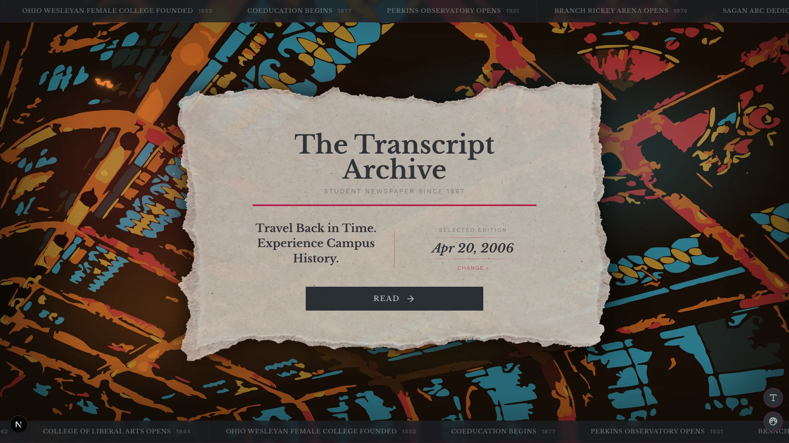
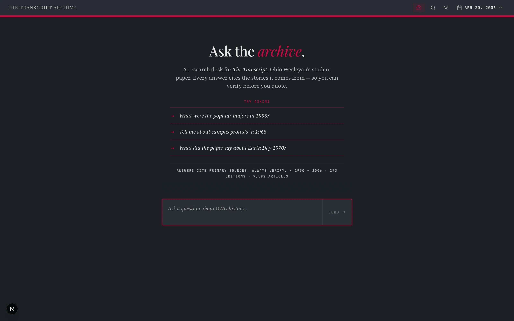
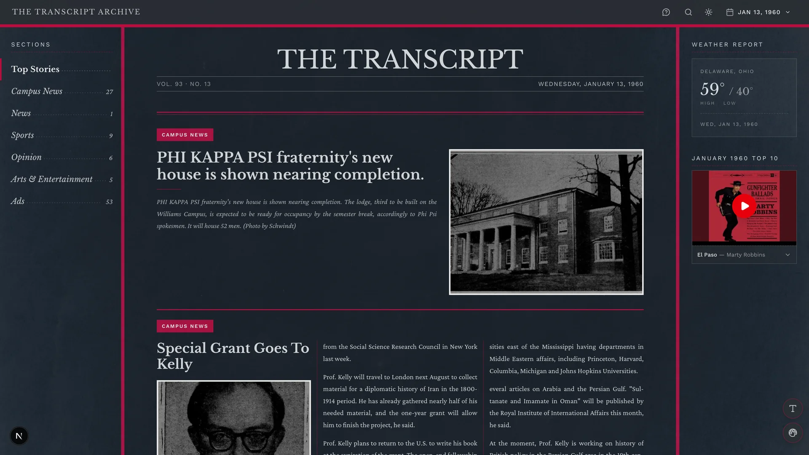
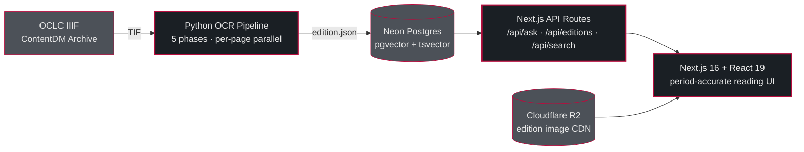

<div align="center">



# The Transcript Archive

**AI-powered searchable archive of Ohio Wesleyan University's student newspaper — half a century of print editions (1950–2006) turned into a multimodal RAG research tool.**

[](https://nextjs.org)
[](https://react.dev)
[](https://www.typescriptlang.org)
[](https://python.org)
[](https://github.com/pgvector/pgvector)
[](https://ai.google.dev)
[](./LICENSE)

</div>

---

> **⚡ Status — Pre-production / portfolio showcase.**
> The project is under active development. The RAG pipeline, OCR pipeline, and data ingestion are functional; the hosted site is not yet public, and the nightly regression workflow is intentionally paused pending stabilization. Run locally to explore.

---

## Table of Contents

1. [Problem & Solution](#problem--solution)
2. [What It Does](#what-it-does)
3. [Screenshots](#screenshots)
4. [System Architecture](#system-architecture)
5. [Tech Stack](#tech-stack)
6. [The RAG Pipeline](#the-rag-pipeline)
7. [The OCR Pipeline](#the-ocr-pipeline)
8. [Multimodal Image Embedding](#multimodal-image-embedding)
9. [Database Schema](#database-schema)
10. [Reliability & Hardening](#reliability--hardening)
11. [Testing Strategy](#testing-strategy)
12. [Getting Started](#getting-started)
13. [Environment Variables](#environment-variables)
14. [Commands](#commands)
15. [Project Structure](#project-structure)
16. [Conventions](#conventions)
17. [Skills Demonstrated](#skills-demonstrated)
18. [Contributing](#contributing)
19. [License](#license)
20. [Acknowledgements](#acknowledgements)

---

## Problem & Solution

Ohio Wesleyan University's student newspaper, *The Transcript*, has been published weekly since 1867. Decades of print editions from the late 20th century exist only as bulk scanned TIF files in the OCLC ContentDM archive — unsearchable, unstructured, and effectively invisible to anyone who didn't know the exact date they were looking for.

**The goal:** turn half a century of print history into a searchable, queryable, AI-augmented research tool that anyone can use to ask natural-language questions about campus life from 1950 through 2006.

**The approach, end-to-end:**

1. **Ingest** raw TIF scans from the ContentDM IIIF archive (custom downloader at `scripts/iiif/`).
2. **OCR** each page through a Python pipeline combining Google Document AI (character-level text), DocLayout-YOLO (photo/illustration region detection), and Google Gemini (structural extraction of articles, headlines, bylines, ads).
3. **Merge** articles that span multiple pages, deduplicate content, and enrich ads with structured metadata.
4. **Store** the structured output in Neon Postgres with both `tsvector` full-text search *and* 768-dim `pgvector` embeddings.
5. **Serve** a Next.js 16 application with a period-accurate reading UI and an "Ask the Archive" page powered by a full RAG pipeline.
6. **Search multimodally** — text queries match text content; visual queries (e.g., "show me protest photos") match article thumbnails and text in a single shared embedding space.

**Scale today:** 293 editions fully ingested (spanning 1950–2006), 2000+ articles with 768-dim multimodal embeddings, 1800+ ads with structured metadata, an offline Ohio weather archive covering 1950–2000 (18,628 daily entries), and a monthly US top-10 music archive for 1958–2000.

---

## What It Does

- **Browse the archive.** Navigate 293 digitized editions with period-accurate typography, date controls, and an era-aware reading experience.
- **Ask the Archive.** Natural-language Q&A powered by a full RAG pipeline: query reformulation, hybrid vector + full-text search, Gemini reranking, and cited answer generation.
- **Multimodal visual queries.** "Show me protest photos" returns a visual-mode answer with a `TimelineGallery` of matching article thumbnails. Text and image embeddings live in the same vector space.
- **End-to-end OCR pipeline.** A Python pipeline turns raw TIF scans into structured `edition.json`: DocAI layout parsing, DocLayout-YOLO region detection, Gemini structuring, cross-page article merging, ad enrichment, and per-run diagnostics.
- **Historical context.** Offline Ohio weather archive (1950–2000) and monthly US top-10 music archive (1958–2000) feed period-accurate sidebars.

---

## Screenshots

<div align="center">

**Ask the Archive — natural-language Q&A input**



<br/><br/>

**Edition reader — January 13, 1960**



</div>

---

## System Architecture



**Six cooperating blocks:**

1. **Frontend.** Next.js App Router with server components, streaming API routes, and feature modules in `src/features/` (`news-feed`, `ask-archive`, `search`, `archive`, `time-controls`, `navigation`, `music-player`, `weather`, `context-panel`, `footer`, `theme`). No cross-feature imports.
2. **API layer.** Server routes in `src/app/api/`. `POST /api/ask` runs the full RAG pipeline. `GET /api/editions/[date]` serves full edition data with articles, ads, and metadata.
3. **Database.** Neon serverless Postgres. Tables: `editions`, `articles`, `ads`, `weather`, `music`. Articles carry both `search_vector tsvector` (auto-maintained via trigger) and `embedding vector(768)` with an HNSW index.
4. **OCR pipeline.** Python 3.12 domain-driven package. Five phases. Parallelized per-page.
5. **Ops scripts.** Shell + Node scripts for seed, embed, cleanup, image upload, weather archive build, and schema migration.
6. **Image CDN.** Cloudflare R2 hosts `.webp` edition images in production via `IMAGE_BASE_URL`; falls back to a local API proxy in dev.

---

## Tech Stack

**Frontend**

- Next.js 16 (App Router) · React 19 · TypeScript 5
- Tailwind CSS v4 with a token-based design system (`src/styles/tokens/`)
- Framer Motion for period-accurate reading animations
- Three.js / React Three Fiber for the landing-page cathedral background
- Libre Baskerville, Crimson Pro, and Work Sans via `next/font/google`

**Backend**

- Next.js API routes (Node.js runtime)
- Neon Postgres (serverless) with `pgvector` HNSW and `tsvector` full-text search
- Cloudflare R2 for edition image hosting (AWS SDK v3)
- Vitest (TypeScript) and pytest (Python) for testing

**AI / Machine Learning**

- **Google Gemini** (`@google/genai`) — OCR structuring, embeddings (`gemini-embedding-001`, 768-dim), reranking, and RAG answer generation
- **Google Document AI** — layout parser for character-level OCR with confidence scoring
- **DocLayout-YOLO** — photo/illustration region detection on scanned pages

**Python OCR Pipeline**

- Python 3.12, `ocr/src/transcript_ocr/` package
- Domain-driven layout: `application/`, `recognition/`, `preprocessing/`, `detection/`, `merging/`, `postprocessing/`, `image_linking/`, `export/`, `diagnostics/`
- Import-boundary and architecture tests enforced in CI (`.github/workflows/ocr-architecture.yml`)

---

## The RAG Pipeline

`POST /api/ask` is the single endpoint that runs the full retrieval-augmented generation flow. Five `src/lib/` modules execute in sequence, each with a timeout and a graceful fallback.

```
query-reformulator.ts → embeddings.ts → db.ts (hybridSearch) → reranker.ts → answer-generator.ts
```

### Query Reformulation

Modern user queries don't match 1960s newspaper language. Asking *"what did students think about the Vietnam War?"* against text that actually uses phrases like *"the war in Indochina"* or *"the conflict in Southeast Asia"* hurts both vector and FTS retrieval.

`query-reformulator.ts` uses Gemini to:

1. **Rewrite** the modern question into period-appropriate vocabulary.
2. **Detect intent** — text query or visual query? (*"show me photos of homecoming"* is visual; *"what did the editorial board say about Nixon?"* is text.)
3. **Produce two distinct outputs** — an `embeddingQuery` tuned for vector search and an `ftsQuery` tuned for keyword match with a different tokenization strategy.

If reformulation fails or times out, the pipeline falls back to the original user query verbatim — degradation, not failure.

### Embedding

`embeddings.ts` calls Google's `gemini-embedding-001` model to produce a 768-dim vector. The input is guarded against token-limit truncation — a pre-flight token count trims at a sentence boundary before sending rather than letting the API silently truncate mid-sentence. For visual queries, the embedding is **multimodal**: query text and any reference image are combined into a single embedding call (see [Multimodal Image Embedding](#multimodal-image-embedding)).

### Hybrid Search

`db.ts` runs two queries in parallel against Neon Postgres:

- **Vector similarity** via the HNSW index on `articles.embedding` (cosine distance)
- **Full-text search** via the GIN index on `articles.search_vector` (`ts_rank_cd` with the reformulated FTS query)

Results are combined using **Reciprocal Rank Fusion** with a 0.7 weight on the vector side in text mode (adjusted in visual mode). Fusion returns the top 8 candidate articles with their individual rank positions, so the frontend and generator can explain *why* a result was included.

### Reranking

The 8 candidates go to Gemini along with the original (not reformulated) question and each article's headline, summary, and body snippet. Gemini scores each 0–10 for relevance. The reranker:

- Accepts decimal scores (`9.5` is valid, not just integers).
- Strips markdown preambles with a whitespace-tolerant regex.
- Filters to score ≥ 3.
- Caps output at 5 articles.
- On total rerank failure, falls back to the vector-only top-N with a **fresh** timeout — not the tail of the original one. (A subtle bug that was fixed during hardening.)

### Answer Generation

`answer-generator.ts` sends the **original** user question (not the reformulated one — the user's phrasing reflects what they actually want) plus the reranked articles to Gemini. The prompt asks for a cited answer with inline source references and returns a structured response:

- `answer` — the synthesized text
- `mode` — `"text"` or `"visual"`
- `imageUrls[]` — populated for visual mode, consumed by the `TimelineGallery` UI
- `sources[]` — the articles used, with FTS rank, vector rank, and rerank score for transparency

Visual queries get a reduced preamble and more aggressive markdown stripping so the answer blends cleanly with the gallery.

The endpoint is rate-limited at 10 req/min per IP, and all user input is wrapped in XML delimiters as a prompt-injection defense.

---

## The OCR Pipeline

The pipeline is a Python 3.12 package at `ocr/src/transcript_ocr/`, organized by domain responsibility rather than technical layer. A CI-enforced architecture test (`.github/workflows/ocr-architecture.yml`) fails the build if any module violates the allowed dependency direction:

```
application → (recognition, preprocessing, detection, image_linking, merging, postprocessing) → shared
```

No `recognition` module can import from `application`; no `shared` module can import from anywhere except itself. This keeps the pipeline composable and prevents the kind of cyclic bloat that usually kills long-lived Python projects.

### Phase 1 — DocAI Extraction (parallel per page)

Each raw TIF is preprocessed (grayscale conversion, CLAHE contrast enhancement, morphological denoising, border crop) and sent to **Google Document AI Layout Parser**. DocAI returns structured text with character-level confidence scores and bounding polygons. In parallel, **DocLayout-YOLO** runs region detection on the same preprocessed image to find photo and illustration regions. Regions are filtered by class (photo/illustration only), minimum area, and aspect ratio.

Module map: `preprocessing/skew.py`, `preprocessing/image_converter.py`, `recognition/docai_provider.py`, `detection/`.

### Phase 2 — Gemini Structuring + Image Linking (parallel per page)

The raw DocAI text plus YOLO regions are sent to Google Gemini with a carefully tuned prompt (`recognition/prompts.py`, loaded via `config/prompts_loader.py`) that structures the page into articles, ads, and content items — each with headline, byline, category, summary, full body text, continuation markers, and bounding-box association.

A **visual matcher** (`image_linking/visual_matcher.py`) then links each detected YOLO region to the most likely article or ad on the page using bounding-box overlap, with Gemini-assisted disambiguation for tricky cases.

### Phase 3 — Cross-Page Merging

Articles flagged with continuation markers (e.g., *"Continued on page 7"*) are merged into single entries across pages. Deterministic rules in `merging/deterministic_merge.py` handle the clean cases; `merging/llm_merge.py` uses Gemini as a tiebreaker for ambiguous merges. Orphan images are consolidated or dropped based on merge decisions. Boundary cleanup (`merging/boundary_cleanup.py`) strips leftover *"Continued from page X"* markers from merged body text.

### Phase 4 — Ad Enrichment

`application/ad_enrichment.py` sends each detected ad crop to Gemini with a specialized extraction prompt (`recognition/ad_prompts.py`) to pull structured metadata: advertiser name, phone, address, price, ad type, category, call-to-action.

### Phase 5 — Diagnostics + Issue Reports

Per-page timing, DocAI mean confidence, Gemini token usage, YOLO statistics, and error context are written to `diagnostics.json`. A separate `issue_report.json` flags detected problems (missing continuations, ambiguous merges, low-confidence pages). The final `edition.json` is written to `public/editions/<date>/`.

### The Rescue Pipeline

During an audit of the first 40+ processed editions, a critical failure mode appeared: on rare pages Gemini would silently return zero candidates for successfully-extracted DocAI text, causing complete content loss for that page — no error, no retry, no fallback triggered.

The **rescue pipeline** (`application/content_rescue.py` + `cli/rescue_content.py` + `recognition/rescue_prompts.py`) triages completed editions, detects pages with suspicious zero-content outcomes, and re-runs them through an alternate Gemini prompt path with safety-off settings. This is explicitly a failure-recovery system, not a first-pass pipeline.

---

## Multimodal Image Embedding

The goal: allow *"show me photos of the homecoming parade"* to actually surface article thumbnails — not just text hits that happen to mention homecoming.

### Embed-Time

`scripts/db/embed.mjs` loads each article's primary image (from `image_urls[]`) at embed time and sends it to `gemini-embedding-001` *alongside* the article text as a single multimodal embedding call. The resulting 768-dim vector lives in `articles.embedding` — same table, same column, same HNSW index. There is no separate "image embedding" column; text and image live in a shared embedding space so a single vector search can match both text queries and visual queries.

### Query-Time

When the reformulator flags a query as visual:

- Hybrid search increases the candidate limit (more results to consider for visual relevance).
- The reranker is instructed that photo quality and captions matter.
- The generator returns `mode: "visual"` and a curated `imageUrls[]` from the reranked articles.

### Rendering

`src/features/ask-archive/components/TimelineGallery.tsx` renders the visual-mode answer as a timeline of article thumbnails with captions — unique to visual-mode responses. Text-mode answers render in the default `AnswerPanel` with source cards.

---

## Database Schema

Designed for Neon serverless Postgres.

```sql
-- Editions (one row per issue)
editions (date PK, publication_info, page_count, article_count)

-- Articles (the core searchable entity)
articles (
  id PK,                   -- '{date}-{index}'
  edition_date FK,
  position, category, headline, summary, full_text, body_plain, byline, page,
  is_hero, is_featured,
  image_urls JSONB,
  image_caption, image_captions JSONB,
  search_vector TSVECTOR,  -- auto-maintained via trigger
  embedding VECTOR(768),   -- multimodal (text + image)
  embedding_model TEXT,    -- provenance: which model produced this vector
  writer_position TEXT
)

-- Indexes:
--   B-tree on edition_date, category, byline (WHERE NOT NULL)
--   GIN on search_vector
--   HNSW on embedding (vector_cosine_ops, m=16, ef_construction=128)

-- Ads (enriched in phase 4 of OCR)
ads (id, edition_date FK, position, title, body, category, ad_type,
     display_text, phone, address, price, image_urls JSONB)

-- Historical context tables
weather (date PK, scope PK, tmax_c, tmin_c, precip_mm, source, ...)
music (year PK, month PK, rank PK, title, artist, youtube_id)
```

### FTS Trigger

A plpgsql trigger auto-maintains `articles.search_vector` on every `INSERT` or `UPDATE`. Weighting:

```
headline   → weight A  (top relevance)
summary    → weight B
byline     → weight C
body_plain → weight C
```

`ts_rank_cd` naturally prioritizes headline matches, then summary, then byline/body — matching how a researcher actually thinks about newspaper relevance. The trigger was added as a bug fix when an earlier version left `search_vector` stale on article updates, causing silently wrong FTS results.

### HNSW Tuning

`m = 16, ef_construction = 128` — a good accuracy/build-time balance for a corpus of ~2000 articles. Pgvector supports both IVF and HNSW; HNSW was chosen because the corpus is small enough that HNSW's query-time advantage matters more than its build-time cost.

`scripts/db/recreate-hnsw-index.mjs` exists for rebuilding the index after bulk re-embeds (e.g., when migrating to a new embedding model).

---

## Reliability & Hardening

Twelve targeted hardening commits that each address a specific failure mode discovered during production use. Every one is worth surfacing: they represent real lessons, not speculative defensive programming.

| Commit | Area | What was wrong |
|---|---|---|
| `18056ce` | Rate limiting | `/api/ask` had no rate limiter; a single user could exhaust the Gemini quota in minutes. Now 10 req/min per IP. |
| `bd0cb13` | Prompt injection | User input was interpolated raw into the generator prompt; a malicious query could override system instructions. Now wrapped in XML delimiters and escaped. |
| `a2c8c2c` | Token limits | Long articles could push embedding input past the token cap and be silently truncated mid-sentence. Now a pre-flight count trims at a sentence boundary before sending. |
| `74d0a50` | FTS correctness | Article updates left `search_vector` stale. Added a plpgsql trigger that auto-maintains on `INSERT`/`UPDATE`. |
| `fd0470b` | Retry backoff | Backoff was indexed by *batch position* rather than retry count, so the 5th batch's 1st retry waited as long as the 1st batch's 5th retry. Fixed to retry-count-based. |
| `744e79e` | Fallback timeouts | Vector-only fallback reused the tail of the rerank timeout and usually timed out immediately. Now creates a fresh timeout. |
| `0d89e57` | Confidence threshold | The "low confidence" signal was computed from total article count rather than vector-search article count, skewing it for heavily-FTS-weighted results. |
| `964d6af` | Reranker parsing | Reranker rejected decimal scores (`9.5`) as "not an integer." Fixed to parse floats. |
| `f5af4e3` | Preamble stripping | Rerank preamble-strip regex required specific whitespace, so some Gemini responses weren't parsed. Relaxed. |
| `80b1017` | FTS NULL vs 0 | When no FTS match existed, distance was emitted as `0` (implying perfect match) instead of `null`. |
| `a3c8c88` | Ad deduplication | Restoring locked editions (like the gold standard) double-inserted ads. Added dedup on restore. |
| `c118f1e` | OCR diagnostics | Merge-retry exhaustion had no diagnostic flag; downstream consumers couldn't detect `merge_skipped` state. Added the flag to `MergePassDiagnostics`. |

The common theme: **every bug was found by observing real behavior, not by imagining what could go wrong.** Every pipeline step has a timeout, a typed error envelope, and a graceful fallback.

---

## Testing Strategy

### TypeScript (Vitest)

- **Lib tests** — `embeddings.test.ts`, `query-reformulator.test.ts`, `reranker.test.ts`, `answer-generator.test.ts`, `db-vector-search.test.ts`
- **API tests** — `ask-route.test.ts` covers the full `/api/ask` integration path with mocked Gemini
- **Component tests** — `ask-archive/source-list.test.tsx`, `news-feed` variants
- **Runner** — `npm run test:run` (CI) or `npm run test` (watch)

### Python (pytest)

- **Unit** — `test_continuation.py`, `test_merging.py`, `test_null_sanitizer.py`, `test_proper_noun.py`, `test_image_converter.py`, `test_merge_helpers.py`
- **Static failure-path tests** — `test_failure_paths_static.py`
- **Architecture / import-boundary tests** (run in CI) — `tests/ocr/architecture/`
- **Contract tests** — `test_artifact_schema_contracts.py` auto-activates after a real pipeline run and validates the shape of emitted JSON artifacts

### CI

- `.github/workflows/nextjs-ci.yml` — typecheck, ESLint, and Vitest on every PR and push to `main`
- `.github/workflows/ocr-architecture.yml` — import-boundary tests and wrapper/entrypoint consistency checks

Architecture tests fail the build if any module violates the `application → (recognition/preprocessing/detection) → shared` dependency direction.

---

## Getting Started

**Prerequisites:** Node.js 20+, Python 3.12, a Neon Postgres database (or any Postgres with `pgvector`), a Google Cloud project with Document AI enabled, and a Google Gemini API key.

```bash
# 1. Clone and install
git clone https://github.com/Bamyani1/interactive-newspaper.git
cd interactive-newspaper
npm install

# 2. Configure environment
cp .env.example .env.local
# Edit .env.local and fill in DATABASE_URL, GOOGLE_API_KEY, etc.

# 3. Seed the database
npm run db:seed          # creates tables + loads existing edition.json files
npm run db:embed         # generates 768-dim vector embeddings for all articles

# 4. Run the app
npm run dev              # http://localhost:3000
```

### OCR Pipeline (processing new scans)

```bash
# One-time Python setup
cd ocr
python -m venv .venv && source .venv/bin/activate
pip install -r requirements.txt
cd ..

# Drop TIF folders into ocr/inbox/<date>/ then:
scripts/ocr/process-edition.sh ocr/inbox/1988-10-12
scripts/ocr/process-unprocessed.sh   # batch-process everything unprocessed

# After OCR completes:
npm run db:seed             # ingest new edition.json files
npm run db:embed            # embed the new articles
npm run images:upload       # push new images to R2
```

### IIIF Archive Download (optional)

```bash
cd scripts/iiif
python -m pip install -r requirements.txt
python extract-manifests.py   # fetch IIIF manifests from ContentDM
python select-batch.py        # pick which ones to download
python download.py            # grab TIFs into ocr/inbox/
```

---

## Environment Variables

Create `.env.local` from `.env.example`:

| Variable | Required | Purpose |
|---|---|---|
| `DATABASE_URL` | Yes | Neon Postgres connection string |
| `GOOGLE_API_KEY` | Yes | Gemini — OCR structuring, embeddings, RAG generation |
| `GOOGLE_CLOUD_PROJECT` | Yes (OCR) | Document AI project ID |
| `DOCUMENT_AI_PROCESSOR_ID` | Yes (OCR) | Document AI layout parser processor |
| `DOCUMENT_AI_LOCATION` | Yes (OCR) | Typically `us` |
| `LAYOUT_PARSER_PROCESSOR_ID` | Optional | Secondary layout processor |
| `R2_ACCOUNT_ID` | Optional | Cloudflare R2 account (production image CDN) |
| `R2_ACCESS_KEY_ID` | Optional | R2 access key |
| `R2_SECRET_ACCESS_KEY` | Optional | R2 secret key |
| `R2_BUCKET_NAME` | Optional | R2 bucket name |
| `IMAGE_BASE_URL` | Optional | R2 public CDN base URL (falls back to a local API proxy in dev) |

**Never commit `.env.local`** — it is already in `.gitignore`.

---

## Commands

| Command | Description |
|---|---|
| `npm run dev` | Start Next.js dev server (hot reload) |
| `npm run build` | Production build |
| `npm run lint` | ESLint |
| `npm run test` | Vitest watch mode |
| `npm run test:run` | Vitest run (CI mode) |
| `npm run test:invariants` | OCR pipeline invariant tests |
| `npm run db:seed` | Seed editions into Neon Postgres |
| `npm run db:reset` | Drop + recreate tables, then seed |
| `npm run db:embed` | Generate vector embeddings for articles |
| `npm run db:embed:force` | Force re-embed all articles |
| `npm run images:upload` | Upload edition images to Cloudflare R2 |
| `npm run weather:build:ohio` | Build offline weather archive (1950–2000) |
| `npm run weather:verify:ohio` | Verify weather archive integrity |
| `scripts/ocr/process-edition.sh <folder>` | Process a single edition end-to-end |
| `scripts/ocr/process-unprocessed.sh` | Batch OCR all new inbox folders |
| `python -m pytest tests/ocr/ -x` | Python OCR test suite |

---

## Project Structure

```
.
├── src/                          # Next.js frontend
│   ├── app/                      # App Router pages + API routes
│   │   ├── api/                  # /api/ask, /api/editions, /api/search, /api/weather
│   │   ├── ask/                  # Ask the Archive page (RAG UI)
│   │   └── edition/[date]/       # Edition reader
│   ├── features/                 # Feature modules (news-feed, ask-archive, search, …)
│   ├── lib/                      # Shared: db, embeddings, answer-generator, reranker, query-reformulator, gemini-client
│   ├── styles/tokens/            # Design tokens (colors, typography, spacing)
│   └── server/                   # Server-only: ocr-adapter (edition.json → DB rows)
│
├── ocr/                          # Python OCR pipeline
│   ├── src/transcript_ocr/       # Domain-driven package
│   │   ├── application/          # edition_pipeline, page_pipeline, ad_enrichment, content_rescue
│   │   ├── recognition/          # DocAI provider, Gemini page extractor, prompts
│   │   ├── preprocessing/        # skew correction, image conversion
│   │   ├── detection/            # DocLayout-YOLO region detection
│   │   ├── merging/              # cross-page article merge, continuation, deduplication
│   │   ├── postprocessing/       # deduplication, ad reclassification, null sanitization
│   │   ├── image_linking/        # visual matcher — region-to-article attribution
│   │   └── contracts/            # typed data models
│   ├── convert_scans.py          # Main OCR entry point
│   ├── enrich_ads.py             # Post-OCR ad enrichment
│   └── rescue_content.py         # Failure-triage CLI for rescue pipeline
│
├── scripts/
│   ├── db/                       # seed, embed, migrate, recreate-hnsw-index
│   ├── ocr/                      # Shell wrappers around the Python pipeline
│   ├── iiif/                     # IIIF archive download tool (OCLC ContentDM)
│   └── weather/                  # Weather archive builders
│
├── public/
│   ├── readme/                   # README hero screenshots
│   ├── shape/                    # Brand SVGs (stained glass, cathedral, doodle)
│   └── data/weather/ohio/        # Offline weather archive
│
└── tests/
    ├── api/, lib/, news-feed/    # Vitest suites
    └── ocr/                      # pytest suite + architecture tests
```

---

## Conventions

- **Conventional commits** — `feat(rag):`, `fix(ocr):`, `chore:`, `docs:`, `ci:`.
- **Feature modules** — business logic lives in `src/features/<feature>/`; no cross-feature imports.
- **API routes** — always validate inputs, return typed JSON, and use correct HTTP status codes.
- **OCR adapter** — `src/server/ocr-adapter/` is the *only* place that transforms `edition.json` → DB shape.
- **Dates** — always `YYYY-MM-DD` strings; never `Date` objects across API boundaries.
- **Design tokens** — colors, typography, and spacing live in `src/styles/tokens/`; components consume semantic tokens (`--color-bg-primary`), not raw hex values.

---

## Skills Demonstrated

<details>
<summary><strong>Frontend engineering</strong></summary>

- React 19, TypeScript 5, Next.js 16 App Router with server components and streaming
- Tailwind CSS v4 with token-based design system
- Framer Motion for period-accurate reading animations
- Three.js / React Three Fiber for the landing-page cathedral background

</details>

<details>
<summary><strong>Backend engineering</strong></summary>

- Next.js API routes with typed envelopes, input validation, and correct HTTP status codes
- Neon serverless Postgres with `pgvector`, HNSW indexing, and tsvector FTS
- Cloudflare R2 integration via AWS SDK v3 for image hosting
- Trigger-based auto-maintenance of derived columns

</details>

<details>
<summary><strong>AI / Machine learning engineering</strong></summary>

- Retrieval-augmented generation end-to-end: query reformulation, hybrid search, reranking, cited generation
- Multimodal embeddings (text + image → single 768-dim vector)
- Hybrid search with Reciprocal Rank Fusion
- Prompt engineering for extraction, structuring, classification, reranking, and generation — each prompt tuned for its specific task
- Hardening against real production failure modes: rate limiting, prompt injection, token truncation, graceful fallbacks, retry logic

</details>

<details>
<summary><strong>Computer vision / OCR</strong></summary>

- Google Document AI Layout Parser integration with per-page parallelization
- DocLayout-YOLO region detection with class/area/aspect-ratio filtering
- Visual bounding-box matching for region-to-article attribution
- Image preprocessing (CLAHE, denoising, skew correction, border crop)

</details>

<details>
<summary><strong>System design</strong></summary>

- Domain-driven package layout (Python OCR pipeline) with enforced import boundaries
- Feature modules (Next.js frontend) with no cross-feature imports
- Explicit separation of concerns: `src/server/ocr-adapter/` is the *only* place that transforms `edition.json` into DB shape
- Dataflow-oriented architecture: TIF → OCR → JSON → DB → vector → answer

</details>

<details>
<summary><strong>Database engineering</strong></summary>

- Schema design for hybrid FTS + vector search
- HNSW tuning (`m = 16, ef_construction = 128`) for small-corpus query performance
- plpgsql trigger for `search_vector` auto-maintenance
- Migration strategy: idempotent `ALTER TABLE ... ADD COLUMN IF NOT EXISTS`

</details>

<details>
<summary><strong>DevOps / ops</strong></summary>

- GitHub Actions CI for architecture and boundary tests
- Shell orchestration scripts for batch OCR processing
- IIIF archive downloader for reproducible data sourcing
- Offline weather and music archives built from public NOAA / Billboard data with integrity verification

</details>

---

## Contributing

See [CONTRIBUTING.md](./CONTRIBUTING.md) for issue filing, the conventional commit format, and the development workflow. This is a solo portfolio project — small focused PRs are welcome; large feature PRs may be declined if they conflict with the roadmap.

---

## License

[MIT](./LICENSE). Copyright © 2026 Mostafa Anwari.

---

## Acknowledgements

This is an unofficial independent student project. *The Transcript* is Ohio Wesleyan University's student newspaper, used here descriptively — this project is not affiliated with, endorsed by, or an official product of Ohio Wesleyan University.

Newspaper scans sourced from the OCLC ContentDM public archive. Weather data from NOAA. Music chart data from the public Billboard Hot 100 history.

Built with [Next.js](https://nextjs.org), [Google Gemini](https://ai.google.dev), [Neon Postgres](https://neon.tech), [pgvector](https://github.com/pgvector/pgvector), [Framer Motion](https://www.framer.com/motion/), [Three.js](https://threejs.org), and many other open-source libraries. Thanks to the teams behind them.
