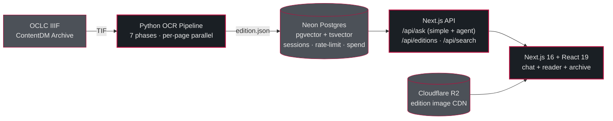

<div align="center">


# The Transcript Archive

**AI-powered searchable archive of Ohio Wesleyan University's student newspaper — half a century of print editions (1950–2006) turned into a multimodal RAG research tool.**

[](https://nextjs.org)
[](https://react.dev)
[](https://www.typescriptlang.org)
[](https://python.org)
[](https://github.com/pgvector/pgvector)
[](https://ai.google.dev)
[](https://github.com/Bamyani1/interactive-newspaper/actions/workflows/nextjs-ci.yml)
[](./LICENSE)

</div>

---

> **⚡ Status — Pre-production / portfolio showcase.**
> The RAG pipeline, OCR pipeline, chat UI, and data ingestion are all functional and running locally. The hosted site is not yet public. Run locally to explore, or read [`docs/architecture/`](./docs/architecture/) for production-level deep-dives on each subsystem.

---

## Table of Contents

1. [Problem & Solution](#problem--solution)
2. [What It Does](#what-it-does)
3. [Screenshots](#screenshots)
4. [System Architecture](#system-architecture)
5. [Architecture Docs](#architecture-docs)
6. [Tech Stack](#tech-stack)
7. [The RAG Pipeline](#the-rag-pipeline)
8. [The OCR Pipeline](#the-ocr-pipeline)
9. [Multimodal Image Embedding](#multimodal-image-embedding)
10. [Database Schema](#database-schema)
11. [Reliability & Hardening](#reliability--hardening)
12. [Testing Strategy](#testing-strategy)
13. [Getting Started](#getting-started)
14. [Environment Variables](#environment-variables)
15. [Commands](#commands)
16. [Project Structure](#project-structure)
17. [Conventions](#conventions)
18. [Skills Demonstrated](#skills-demonstrated)
19. [Contributing](#contributing)
20. [License](#license)
21. [Acknowledgements](#acknowledgements)

---

## Problem & Solution

Ohio Wesleyan University's student newspaper, *The Transcript*, has been published weekly since 1867. Decades of print editions from the late 20th century exist only as bulk scanned TIF files in the OCLC ContentDM archive — unsearchable, unstructured, and effectively invisible to anyone who didn't know the exact date they were looking for.

**The goal:** turn half a century of print history into a searchable, queryable, AI-augmented research tool that anyone can use to ask natural-language questions about campus life from 1950 through 2006.

**The approach, end-to-end:**

1. **Ingest** raw TIF scans from the ContentDM IIIF archive (custom downloader at `scripts/iiif/`).
2. **OCR** each page through a Python pipeline combining Google Document AI (character-level text), DocLayout-YOLO (photo/illustration region detection), and Google Gemini (structural extraction of articles, headlines, bylines, ads).
3. **Merge** articles that span multiple pages, deduplicate content, and enrich ads with structured metadata.
4. **Store** the structured output in Neon Postgres with both `tsvector` full-text search *and* 768-dim `pgvector` embeddings.
5. **Serve** a Next.js 16 application with a period-accurate reading UI and an "Ask the Archive" chat experience powered by a full RAG pipeline with agent-loop fallback for complex queries.
6. **Search multimodally** — text queries match text content; visual queries (e.g., "show me protest photos") match article thumbnails and text in a single shared embedding space.

**Scale today:** ~290 editions fully ingested, ~9,600 articles with 768-dim multimodal embeddings, ~6,800 ads with structured metadata, a multi-thread conversation archive, an offline Ohio weather archive covering 1950–2000 (18,628 daily entries), and a monthly US top-10 music archive for 1958–2000.

---

## What It Does

- **Browse the archive.** Navigate digitized editions with period-accurate typography, date controls, and an era-aware reading experience.
- **Ask the Archive.** Natural-language chat over the archive with a full RAG pipeline: query reformulation, hybrid vector + full-text search, Gemini reranking, cited answer generation, and streaming SSE responses.
- **Complex queries get an agent.** Multi-era, comparative, or multi-hop questions trigger a Gemini function-calling agent with `search_archive`, `read_article`, and `list_editions` tools instead of the linear pipeline.
- **Multi-thread conversations.** Sessions persist to Neon (5 turns, 30-min TTL). A sidebar shows the current thread plus an archive of past threads. Follow-up questions carry context.
- **Budget-aware by default.** A $0.50/day hard kill switch stops the pipeline before a runaway loop can drain the Gemini quota.
- **Multimodal visual queries.** "Show me protest photos" returns a visual-mode answer with a `TimelineGallery` of matching article thumbnails. Text and image embeddings live in the same vector space.
- **End-to-end OCR pipeline.** A seven-phase Python pipeline turns raw TIF scans into structured `edition.json`: DocAI layout parsing, DocLayout-YOLO region detection, Gemini structuring, cross-page article merging, ad enrichment, content triage, and per-run diagnostics.
- **Historical context.** Offline Ohio weather archive (1950–2000) and monthly US top-10 music archive (1958–2000) feed period-accurate sidebars.

---

## Screenshots

<div align="center">

**Ask the Archive — chat transcript with pinned composer and thread sidebar**


<br/><br/>

**Edition reader — January 13, 1960**


</div>

---

## System Architecture



**Six cooperating blocks:**

1. **Frontend.** Next.js App Router with server components, streaming API routes, and feature modules in `src/features/` (`news-feed`, `ask-archive`, `search`, `archive`, `time-controls`, `navigation`, `music-player`, `weather`, `context-panel`, `footer`, `theme`). No cross-feature imports.
2. **API layer.** Server routes in `src/app/api/`. `POST /api/ask` runs the RAG pipeline (streaming or JSON). `GET /api/editions/[date]` serves full edition data. `GET /api/ask/session` rehydrates conversation history.
3. **Database.** Neon serverless Postgres. Tables: `editions`, `articles`, `ads`, `weather`, `music`, `ask_session_turns`, `ai_spend_counter`, `api_rate_bucket`, `ask_feedback`. Articles carry both `search_vector tsvector` (auto-maintained via trigger) and `embedding vector(768)` with an HNSW index.
4. **OCR pipeline.** Python 3.12 domain-driven package with enforced import boundaries. Seven phases, parallel per-page for phases 1–2.
5. **Ops scripts.** Shell + Node scripts for seed, embed, cleanup, image upload, weather archive build, and schema migrations.
6. **Image CDN.** Cloudflare R2 hosts `.webp` edition images in production via `IMAGE_BASE_URL`; falls back to a local API proxy in dev.

---

## Architecture Docs

For production-level deep-dives on each subsystem — intended for contributors and senior engineers reviewing the code:

- **[docs/architecture/README.md](./docs/architecture/README.md)** — reading order, glossary, and troubleshooting shortcuts
- **[docs/architecture/ocr-pipeline.md](./docs/architecture/ocr-pipeline.md)** — seven-phase Python OCR pipeline, layer architecture, LLM integration, failure modes, gotchas
- **[docs/architecture/rag-pipeline.md](./docs/architecture/rag-pipeline.md)** — `/api/ask` end-to-end: simple pipeline, agent loop, streaming, caching, dedup, budget, error taxonomy
- **[docs/architecture/data-model.md](./docs/architecture/data-model.md)** — schema, `edition.json` contract, embeddings, HNSW, migrations, the ocr-adapter boundary

The three docs cross-reference each other and share a glossary. Read them in order if you're new.

---

## Tech Stack

**Frontend**

- Next.js 16 (App Router) · React 19 · TypeScript 5
- Tailwind CSS v4 with a token-based design system (`src/styles/tokens/`)
- Framer Motion for period-accurate reading animations
- `react-markdown` + `remark-gfm` for chat answer rendering
- Playfair Display, Source Serif 4, JetBrains Mono, and Inter via `next/font/google`

**Backend**

- Next.js API routes (Node.js runtime)
- Neon Postgres (serverless) with `pgvector` HNSW and `tsvector` full-text search
- Cloudflare R2 for edition image hosting (AWS SDK v3)
- Vitest (TypeScript) and pytest (Python) for testing

**AI / Machine Learning**

- **Google Gemini** (`@google/genai`) — OCR structuring, embeddings (`gemini-embedding-2-preview`, 768-dim), reranking, RAG answer generation, and agent-loop function calling
- **Google Document AI** — layout parser for character-level OCR with confidence scoring
- **DocLayout-YOLO** — photo/illustration region detection on scanned pages

**Python OCR Pipeline**

- Python 3.12, `ocr/src/transcript_ocr/` package
- Domain-driven layout with ten domain layers (`application/`, `recognition/`, `preprocessing/`, `detection/`, `merging/`, `postprocessing/`, `image_linking/`, `export/`, `diagnostics/`, `ingestion/`) plus infrastructure (`contracts/`, `shared/`, `config/`)
- Import-boundary and architecture tests enforced in CI (`.github/workflows/ocr-architecture.yml`)

---

## The RAG Pipeline

`POST /api/ask` is the single endpoint that runs retrieval-augmented generation. Two paths share the same guards:

```
Simple pipeline:  reformulate → embed → hybridSearch → rerank (+ CRAG retry) → generate
Agent loop:       reformulate → agent[search/read/list] → generate
```

The reformulator classifies the question as `simple` or `complex`; simple questions run the 5-stage pipeline, complex questions get the agent. Both paths support streaming SSE (`?stream=1`) and plain JSON.

For the full end-to-end deep-dive — error taxonomy, dedup, caching, agent tool interface, confidence thresholds, and the operator runbook — see **[docs/architecture/rag-pipeline.md](./docs/architecture/rag-pipeline.md)**. What follows here is a summary.

### Query reformulation

Modern user queries don't match 1960s newspaper language. "What did students think about the Vietnam War?" against text that uses "the war in Indochina" or "the conflict in Southeast Asia" hurts both vector and FTS retrieval.

`query-reformulator.ts` uses Gemini to rewrite the question into period-appropriate vocabulary, detect text-vs-visual intent, produce separate `embeddingQuery` and `ftsQuery` outputs, and classify complexity (simple vs complex). Era-specific synonym expansion is baked into the prompt (e.g., `basketball → cagers OR hoopsters`). On timeout, falls back to the original question.

### Embedding & retrieval

`embeddings.ts` produces 768-dim vectors via `gemini-embedding-2-preview`. LRU cache with 5-min TTL. Quota-aware backoff. `db.ts :: hybridSearch` runs vector (HNSW, `hnsw.ef_search=100`) and FTS (`ts_rank_cd`) in parallel, then merges via Reciprocal Rank Fusion with mode-specific weights (0.7/0.3 for visual, 0.6/0.4 for text).

### Reranking with CRAG

Retrieved articles go to Gemini with explicit score anchors (0–10). Scores ≥4 (text) / ≥3 (visual) survive. On zero-result ranking, **one corrective retrieval retry** runs with broader search terms — a single-pass CRAG.

### Answer generation

The answer generator receives the **original** user question plus reranked articles. A skip-Gemini guard fires for clearly off-topic retrieval (avg distance > 0.3 AND reranker score < 5), returning a canned "not enough information" answer without burning tokens. Empirically calibrated confidence thresholds (low/medium/high) drive downstream caching and UI.

### Agent loop for complex questions

`agent-loop.ts` — constrained Gemini function-calling loop with three tools (`search_archive`, `read_article`, `list_editions`). `MAX_ROUNDS = 8`, AbortSignal-aware, tool result truncation to bound context size. Agent responses skip caching and dedup since their context is query-specific.

### Conversation threading

`conversation-store.ts` persists turns to Neon `ask_session_turns` (5 turns, 30-min window). `persistTurnBounded` caps the write at 1500 ms so a slow DB never stutters the final `done` event. The sidebar surfaces active thread + archived threads from localStorage. "New conversation" mints a fresh session; "Clear thread" wipes the Neon rows.

### Guards

- **Rate limiting**: two layers (middleware + route), 10 req/min per IP on `/api/ask`, Neon-backed with in-memory fallback
- **Daily budget**: $0.50/day hard stop via `ai_spend_counter` table (`cost-tracker.ts`)
- **Concurrent dedup**: identical in-flight (ip, question, filters, sessionId) requests share one pipeline run (JSON path only)
- **Global deadline**: `GLOBAL_DEADLINE_MS = 30_000`; all stages race against it
- **Prompt-injection defense**: user input wrapped in XML delimiters before prompting

---

## The OCR Pipeline

The pipeline is a Python 3.12 package at `ocr/src/transcript_ocr/`, organized by domain responsibility. A CI-enforced architecture test fails the build if any module violates the dependency direction:

```
application → (recognition | preprocessing | detection | merging |
               postprocessing | image_linking | export | diagnostics | ingestion)
            → (contracts | shared | config)
```

No lower layer can import `application`; `contracts` and `shared` can't import any domain layer. AST-based static checks in `tests/ocr/architecture/`.

For the full seven-phase walkthrough, LLM retry policy, diagnostics, and gotchas, see **[docs/architecture/ocr-pipeline.md](./docs/architecture/ocr-pipeline.md)**.

### Seven phases

| Phase | Purpose | Output |
|---|---|---|
| 0 | TIF → grayscale PNG | sanitized page images |
| 1a | Per-page preprocessing | deskewed, contrast-enhanced images |
| 1b | YOLO region detection | photo/illustration bounding boxes |
| 1c | DocAI text extraction | paragraphs + token confidence |
| 2 | Gemini page structuring | articles, ads, other content per page |
| 3 | Cross-page merging | stitched continuations |
| 4 | Ad enrichment | category, type, contact fields |
| 5 | Content triage | ghost-article demotion, rescue promotion |
| 6 | Write `edition.json` + diagnostics | canonical JSON + `issue_report.json` |

### Gotchas worth knowing

- **Retry model swap**: every retry uses `gemini-3-flash-preview` regardless of the original model request. A failed Pro merge will retry on Flash with different quality.
- **RECITATION handling**: Gemini's content filter blocks verbatim text reproduction from system instructions; the page extractor moves OCR text to user contents on RECITATION.
- **Atomic writes**: Phases 4 and 5 use `tempfile.mkstemp` + `os.replace` to prevent file-name collisions if two processes hit the same edition.
- **`MERGE_MIN_CONFIDENCE=1.0`** disables LLM merges, leaving only deterministic continuation stitching — useful for debugging bad merges.
- **DocAI 18 MB cap**: `_prepare_image_for_docai()` raises before DocAI's real 20 MB limit, with a 2 MB safety margin.

Full set: [docs/architecture/ocr-pipeline.md § Gotchas](./docs/architecture/ocr-pipeline.md#gotchas).

---

## Multimodal Image Embedding

The goal: *"show me photos of the homecoming parade"* should actually surface article thumbnails — not just text hits that happen to mention homecoming.

### Embed-time

`scripts/db/embed.mjs` loads each article's primary image at embed time and sends it to `gemini-embedding-2-preview` *alongside* the article text as a single multimodal embedding call. The resulting 768-dim vector lives in `articles.embedding`. Text and image share one embedding space, so a single vector search can match both modalities.

### Query-time

When the reformulator flags a query as visual:

- Hybrid search increases the candidate limit (more results to consider for visual relevance).
- The reranker is instructed that photo quality and captions matter.
- The generator returns `mode: "visual"` and a curated `imageUrls[]` from the reranked articles.

### Rendering

`src/features/ask-archive/components/TimelineGallery.tsx` renders the visual-mode answer as a timeline of article thumbnails. Text-mode answers render in the default chat transcript.

---

## Database Schema

Designed for Neon serverless Postgres. Full schema in [scripts/db/schema.sql](./scripts/db/schema.sql); column-by-column details in [docs/architecture/data-model.md](./docs/architecture/data-model.md).

```sql
-- Core content
editions (date PK, publication_info, page_count, article_count)

articles (
  id PK,                                -- '{date}-{index}'
  edition_date FK,
  position, category, headline, summary, full_text, body_plain, byline, page,
  writer_position, is_hero, is_featured,
  image_urls JSONB, image_caption, image_captions JSONB,
  search_vector TSVECTOR,                -- auto-maintained via trigger
  embedding VECTOR(768),                 -- multimodal (text + image)
  embedding_model TEXT                   -- model provenance
)

ads (id, edition_date FK, position, title, body, category, ad_type,
     display_text, phone, address, price, image_urls JSONB)

-- RAG infrastructure
ask_session_turns (id, session_id, question, answer, cited_article_ids, created_at)
ai_spend_counter  (day PK, spent_usd, updated_at)                   -- $0.50/day kill switch
api_rate_bucket   (key PK, count, expires_at, created_at)           -- sliding window
ask_feedback      (id, request_id, question, answer, vote, …)       -- thumbs up/down

-- Historical context
weather (date PK, scope PK, tmax_c, tmin_c, precip_mm, source, ...)
music   (year PK, month PK, rank PK, title, artist, youtube_id)
```

Indexes:

- B-tree on `articles.edition_date`, `articles.category`, `articles.byline (WHERE NOT NULL)`
- GIN on `articles.search_vector`
- HNSW on `articles.embedding` with `m=16, ef_construction=128`; queries use `hnsw.ef_search=100`

A plpgsql trigger auto-maintains `articles.search_vector` with weights headline(A) > summary(B) > byline=body_plain(C).

### Embedding preservation

The seed script snapshots embeddings by content fingerprint (`JSON.stringify([headline, byline, body_plain, category])`) before each delete-and-reinsert cycle, then restores matching ones. This means re-seeding an unchanged edition preserves all embeddings without re-billing the Gemini API. See [data-model.md § Embedding preservation](./docs/architecture/data-model.md#embedding-preservation--the-fingerprint-mechanism).

---

## Reliability & Hardening

A representative sample of commits that each address a real failure mode discovered during development, not speculative defensive programming:

| Commit | Area | What was wrong |
|---|---|---|
| `18056ce` | Rate limiting | `/api/ask` had no rate limiter; a single user could exhaust the Gemini quota in minutes. Now 10 req/min per IP, durable. |
| `bd0cb13` | Prompt injection | User input was interpolated raw into the generator prompt. Now wrapped in XML delimiters and escaped. |
| `a2c8c2c` | Token limits | Long articles could push embedding input past the token cap. Now a pre-flight count trims at a sentence boundary. |
| `74d0a50` | FTS correctness | Article updates left `search_vector` stale. Added a plpgsql trigger that auto-maintains on INSERT/UPDATE. |
| `fd0470b` | Retry backoff | Backoff was indexed by batch position rather than retry count. Fixed. |
| `744e79e` | Fallback timeouts | Vector-only fallback reused the tail of the rerank timeout. Now creates a fresh timeout. |
| `964d6af` | Reranker parsing | Reranker rejected decimal scores (`9.5`). Now parses floats. |
| `a3c8c88` | Ad deduplication | Restoring locked editions double-inserted ads. Added dedup on restore. |
| `ddab849` | Conversation durability | `done` event could fire before the turn was persisted. Added `persistTurnBounded` 1.5s cap. |
| `7eb5b03` | History truncation | Long answers bloated `ask_session_turns`. Now capped at 8000 chars with a truncation marker. |
| `0b04000` | Reranker bounds | Reranker fallback could exceed `maxArticles`. Capped. |
| `35139f7` | Cache correctness | Answer cache was serving context-flavored answers across sessions. Now bypassed when conversation history is non-empty. |

Every pipeline step has a timeout, a typed error envelope with a `kind` discriminator, and a graceful fallback. Every LLM call has retry with model fallback.

---

## Testing Strategy

### TypeScript (Vitest)

- **Lib tests** — `embeddings.test.ts`, `query-reformulator.test.ts`, `reranker.test.ts`, `answer-generator.test.ts`, `db-vector-search.test.ts`, `agent-loop.test.ts`, `agent-tools.test.ts`, `answer-cache.test.ts`, `rate-limit.test.ts`
- **API tests** — `ask-route.test.ts` (70 tests) covers the full `/api/ask` pipeline, streaming, dedup, and error taxonomy with mocked Gemini
- **Golden RAG regression** — `rag-golden-questions.test.ts` with baseline drift detection against `rag-golden-baseline.json`; hard regressions (status change, confidence drop ≥2, citations halved) fail CI
- **Component tests** — `ask-archive`, `news-feed` variants
- **Runner** — `npm run test:run` (CI) or `npm run test` (watch)

### Python (pytest)

- **Unit** — `test_continuation.py`, `test_merging.py`, `test_null_sanitizer.py`, `test_image_converter.py`, `test_merge_helpers.py`, `test_boundary_cleanup.py`, `test_byline_cleanup.py`, `test_best_body.py`
- **DocAI / preprocessing** — `test_docai_provider.py`, `test_prepare_image_for_docai.py`, `test_page_quality.py`, `test_region_filters.py`
- **Failure paths** — `test_failure_paths_static.py`
- **Architecture / import-boundary tests** (run in CI) — `tests/ocr/architecture/`
- **Contract tests** — `test_artifact_schema_contracts.py`

### CI

- `.github/workflows/nextjs-ci.yml` — typecheck, ESLint, and Vitest on every PR and push to `main`
- `.github/workflows/ocr-architecture.yml` — AST-based import-boundary enforcement and wrapper/entrypoint consistency checks

---

## Getting Started

**Prerequisites:** Node.js 20+, Python 3.12, a Neon Postgres database (or any Postgres with `pgvector`), a Google Cloud project with Document AI enabled, and a Google Gemini API key.

```bash
# 1. Clone and install
git clone https://github.com/Bamyani1/interactive-newspaper.git
cd interactive-newspaper
npm install

# 2. Configure environment
cp .env.example .env.local
# Edit .env.local and fill in DATABASE_URL, GOOGLE_API_KEY, etc.

# 3. Seed the database
npm run db:seed          # creates tables + loads existing edition.json files
npm run db:embed         # generates 768-dim vector embeddings for all articles

# 4. Run the app
npm run dev              # http://localhost:3000
```

### OCR Pipeline (processing new scans)

```bash
# One-time Python setup
cd ocr
python -m venv .venv && source .venv/bin/activate
pip install -r requirements.txt
cd ..

# Drop TIF folders into ocr/inbox/<YYYY-MM-DD>/ then:
scripts/ocr/process-edition.sh ocr/inbox/1988-10-12
scripts/ocr/process-unprocessed.sh   # batch-process everything unprocessed

# After OCR completes, the shell wrapper handles seed + embed + image upload.
```

### IIIF Archive Download (optional)

```bash
cd scripts/iiif
python -m pip install -r requirements.txt
python extract-manifests.py   # fetch IIIF manifests from ContentDM
python select-batch.py        # pick which ones to download
python download.py            # grab TIFs into ocr/inbox/
```

### Running migrations

All migrations are idempotent (`IF NOT EXISTS`) and safe to run multiple times. Core tables are created by `scripts/db/schema.sql` (applied automatically on `db:seed`). The `ask_session_turns`, `ai_spend_counter`, and `api_rate_bucket` tables are also created by `schema.sql`. The `migrate-rag-improvements.mjs` script has a **mandatory follow-up** — see [data-model.md § Migrations](./docs/architecture/data-model.md#migrations).

---

## Environment Variables

Create `.env.local` from `.env.example`:

| Variable | Required | Purpose |
|---|---|---|
| `DATABASE_URL` | Yes | Neon Postgres connection string |
| `GOOGLE_API_KEY` | Yes | Gemini — OCR structuring, embeddings, RAG generation |
| `GOOGLE_CLOUD_PROJECT` | Yes (OCR) | Document AI project ID |
| `DOCUMENT_AI_PROCESSOR_ID` | Yes (OCR) | Document AI layout parser processor |
| `DOCUMENT_AI_LOCATION` | Yes (OCR) | Typically `us` |
| `LAYOUT_PARSER_PROCESSOR_ID` | Optional | Secondary layout processor |
| `R2_ACCOUNT_ID` | Optional | Cloudflare R2 account (production image CDN) |
| `R2_ACCESS_KEY_ID` | Optional | R2 access key |
| `R2_SECRET_ACCESS_KEY` | Optional | R2 secret key |
| `R2_BUCKET_NAME` | Optional | R2 bucket name |
| `IMAGE_BASE_URL` | Optional | R2 public CDN base URL (falls back to a local API proxy in dev) |
| `ADMIN_REVALIDATE_TOKEN` | Optional | Auth token for `/api/admin/revalidate` |
| `OCR_WORKERS` | Optional | Parallel worker count for OCR pipeline (default 1) |
| `GEMINI_REQUEST_TIMEOUT_S` | Optional | Per-call Gemini timeout (default 120) |
| `GEMINI_CALL_SPACING_S` | Optional | Minimum gap between Gemini calls (default 0.5) |
| `MERGE_MIN_CONFIDENCE` | Optional | Cross-page merge confidence gate (default 0.5) |

**Never commit `.env.local`** — it is already in `.gitignore`.

---

## Commands

| Command | Description |
|---|---|
| `npm run dev` | Start Next.js dev server (hot reload) |
| `npm run build` | Production build |
| `npm run lint` | ESLint |
| `npm run test` | Vitest watch mode |
| `npm run test:run` | Vitest run (CI mode) |
| `npm run test:invariants` | OCR pipeline invariant tests |
| `npm run db:seed` | Seed editions into Neon Postgres |
| `npm run db:reset` | Drop + recreate tables, then seed |
| `npm run db:embed` | Generate vector embeddings for articles (incremental) |
| `npm run db:embed:force` | Force re-embed all articles |
| `npm run images:upload` | Upload edition images to Cloudflare R2 |
| `npm run weather:build:ohio` | Build offline weather archive (1950–2000) |
| `npm run weather:verify:ohio` | Verify weather archive integrity |
| `scripts/ocr/process-edition.sh <folder>` | Process a single edition end-to-end |
| `scripts/ocr/process-unprocessed.sh` | Batch OCR all new inbox folders |
| `python -m pytest tests/ocr/ -x` | Python OCR test suite |

---

## Project Structure

```
.
├── src/                          # Next.js frontend
│   ├── app/                      # App Router pages + API routes
│   │   ├── api/                  # /api/ask, /api/editions, /api/search, /api/weather, /api/admin
│   │   ├── ask/                  # Ask the Archive chat page
│   │   └── edition/[date]/       # Edition reader
│   ├── features/                 # Feature modules (ask-archive, news-feed, search, …)
│   ├── lib/                      # Shared services — see below
│   ├── styles/tokens/            # Design tokens (colors, typography, spacing)
│   ├── server/                   # Server-only: ocr-adapter (edition.json → DB rows)
│   └── components/               # Cross-cutting components (landing hero, etc.)
│
├── src/lib/                      # Shared services (flat TS modules)
│   ├── agent-loop.ts             # Gemini function-calling agent
│   ├── agent-tools.ts            # search_archive, read_article, list_editions
│   ├── answer-cache.ts           # 1-hour in-memory answer LRU
│   ├── answer-generator.ts       # Gemini cited-answer generation
│   ├── ask-dedup.ts              # Concurrent-request coalescing
│   ├── conversation-store.ts     # Neon-backed session turns
│   ├── cost-tracker.ts           # Daily budget kill switch
│   ├── db.ts                     # Hybrid search, vector search, FTS
│   ├── editions-server.ts        # Cached edition list + prod DB-outage guard
│   ├── embeddings.ts             # gemini-embedding-2-preview + LRU
│   ├── gemini-client.ts          # Shared client factory
│   ├── gold-edition.ts           # Gold fallback loader
│   ├── image-url.ts              # R2 CDN ↔ dev API proxy URL resolver
│   ├── ocr-adapter.ts            # Re-export shim for src/server/ocr-adapter
│   ├── parse-publication-info.ts # "Vol. 93 · No. 13" masthead parser
│   ├── query-reformulator.ts     # Era-aware query expansion
│   ├── rate-limit.ts             # Neon + in-memory sliding window
│   ├── reranker.ts               # LLM reranker + graceful fallback
│   ├── rerank-signals.ts         # Retrieval-shape telemetry
│   ├── weather-local-archive.ts  # Local JSON weather archive (1950–2000)
│   └── weather.ts                # NOAA/ACIS/Open-Meteo weather lookup
│
├── ocr/                          # Python OCR pipeline
│   ├── src/transcript_ocr/       # Domain-driven package (see docs/architecture/ocr-pipeline.md)
│   ├── convert_scans.py          # OCR CLI entry point
│   └── enrich_ads.py             # Ad-enrichment CLI
│
├── scripts/
│   ├── db/                       # seed, embed, migrate, recreate-hnsw-index
│   ├── ocr/                      # Shell wrappers around the Python pipeline
│   ├── iiif/                     # IIIF archive download tool (OCLC ContentDM)
│   └── weather/                  # Weather archive builders
│
├── docs/
│   ├── architecture/             # Three deep-dive docs + landing page
│   └── issues/                   # Issue log
│
├── public/
│   ├── readme/                   # README hero screenshots
│   ├── shape/                    # Brand SVGs (stained glass, cathedral, doodle)
│   └── data/weather/ohio/        # Offline weather archive
│
└── tests/
    ├── api/, lib/, news-feed/    # Vitest suites
    ├── ocr/                      # pytest suite + architecture tests
    └── ocr-adapter/              # Adapter image-rule predicates
```

---

## Conventions

- **Conventional commits** — `feat(rag):`, `fix(ocr):`, `chore:`, `docs:`, `refactor:`, `ci:`. Summary ≤ 70 chars.
- **Feature modules** — business logic lives in `src/features/<feature>/`; no cross-feature imports.
- **API routes** — always validate inputs, return typed JSON with the `AskErrorKind` discriminator, and use correct HTTP status codes.
- **OCR adapter** — `src/server/ocr-adapter/` is the *only* place that transforms `edition.json` → DB shape. Restores must go through this path, not raw SQL.
- **Dates** — always `YYYY-MM-DD` strings; never `Date` objects across API boundaries.
- **Design tokens** — colors, typography, and spacing live in `src/styles/tokens/`; components consume semantic tokens (`--color-*`, `--owu-*`), not raw hex values.
- **Path aliases** — `@/*`, `@/features/*`, `@/shared/*`, `@/styles/*` per `tsconfig.json`.
- **Pipeline changes** — bug fixes OK; new behavior needs explicit approval (per CLAUDE.md).

---

## Skills Demonstrated

<details>
<summary><strong>Frontend engineering</strong></summary>

- React 19, TypeScript 5, Next.js 16 App Router with server components and streaming SSE
- Tailwind CSS v4 with a token-based design system
- Framer Motion for period-accurate reading animations
- Pure-React / CSS landing hero with layered SVG animations (no Three.js)
- Pinned chat composer with sidebar thread archive, keyboard-nav, and a11y live regions

</details>

<details>
<summary><strong>Backend engineering</strong></summary>

- Next.js API routes with typed envelopes, input validation, and correct HTTP status codes
- Neon serverless Postgres with `pgvector` HNSW and `tsvector` FTS
- Cloudflare R2 integration via AWS SDK v3 for image hosting
- Trigger-based auto-maintenance of derived columns
- Durable rate limiting + in-memory fallback
- Daily-budget kill switch via atomic DB increments
- Concurrent-request dedup with exactly-once extraction pattern

</details>

<details>
<summary><strong>AI / Machine learning engineering</strong></summary>

- Retrieval-augmented generation end-to-end: query reformulation, hybrid search with RRF, LLM reranking with CRAG, cited generation
- Constrained Gemini function-calling agent for complex multi-hop queries (bounded rounds, AbortSignal-aware)
- Multimodal embeddings (text + image → single 768-dim vector)
- Empirically calibrated confidence thresholds tied to a golden regression suite with drift detection
- Prompt engineering for extraction, structuring, classification, reranking, generation, and tool-calling — each prompt tuned for its task
- Hardening against real production failure modes: rate limiting, prompt injection, token truncation, graceful fallbacks, retry logic with model fallback

</details>

<details>
<summary><strong>Computer vision / OCR</strong></summary>

- Google Document AI Layout Parser integration with per-page parallelization
- DocLayout-YOLO region detection with class/area/aspect-ratio filtering and IoU-based NMS
- Visual bounding-box matching for region-to-article attribution, with geometric fallback
- Image preprocessing (CLAHE, denoising, skew correction, border crop, unsharp mask)

</details>

<details>
<summary><strong>System design</strong></summary>

- Domain-driven package layout (Python OCR pipeline) with AST-enforced import boundaries
- Feature modules (Next.js frontend) with no cross-feature imports
- Explicit separation of concerns: `src/server/ocr-adapter/` is the *only* place that transforms `edition.json` into DB shape
- Dataflow-oriented architecture: TIF → OCR → JSON → DB → vector → answer

</details>

<details>
<summary><strong>Database engineering</strong></summary>

- Schema design for hybrid FTS + vector search
- HNSW tuning (`m=16, ef_construction=128, hnsw.ef_search=100`) for small-corpus query performance
- plpgsql trigger for `search_vector` auto-maintenance
- Content-fingerprint embedding preservation across re-seeds (avoids expensive re-embeds)
- Migration strategy: idempotent `ALTER TABLE ... ADD COLUMN IF NOT EXISTS`

</details>

<details>
<summary><strong>DevOps / ops</strong></summary>

- GitHub Actions CI for architecture and boundary tests
- Shell orchestration scripts for batch OCR processing
- IIIF archive downloader for reproducible data sourcing
- Offline weather and music archives built from public NOAA / Billboard data with integrity verification
- Atomic tempfile + `os.replace` writes for concurrent-safe JSON updates
- Golden regression with baseline drift detection

</details>

---

## Contributing

See [CONTRIBUTING.md](./CONTRIBUTING.md) for issue filing, the conventional commit format, and the development workflow. This is a solo portfolio project — small focused PRs are welcome; large feature PRs may be declined if they conflict with the roadmap.

---

## License

[MIT](./LICENSE). Copyright © 2026 Mostafa Anwari.

---

## Acknowledgements

This is an unofficial independent student project. *The Transcript* is Ohio Wesleyan University's student newspaper, used here descriptively — this project is not affiliated with, endorsed by, or an official product of Ohio Wesleyan University.

Newspaper scans sourced from the OCLC ContentDM public archive. Weather data from NOAA. Music chart data from the public Billboard Hot 100 history.

Built with [Next.js](https://nextjs.org), [Google Gemini](https://ai.google.dev), [Neon Postgres](https://neon.tech), [pgvector](https://github.com/pgvector/pgvector), [Framer Motion](https://www.framer.com/motion/), and many other open-source libraries. Thanks to the teams behind them.
