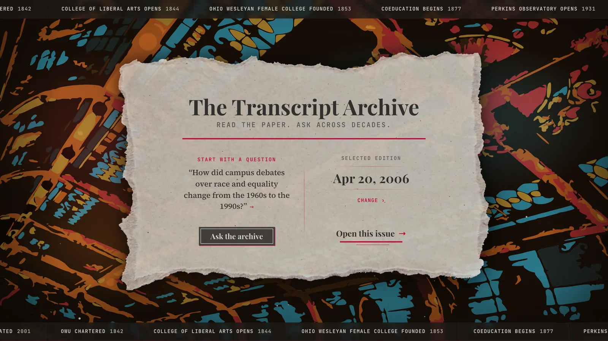
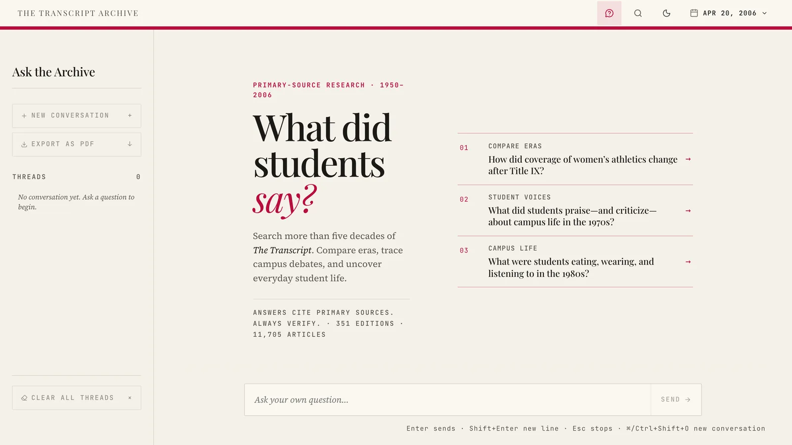
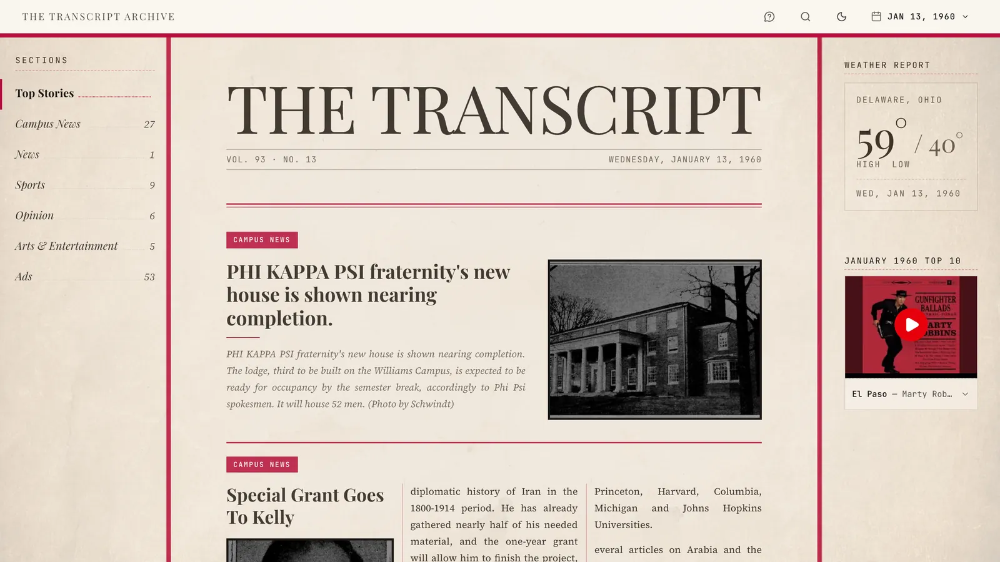
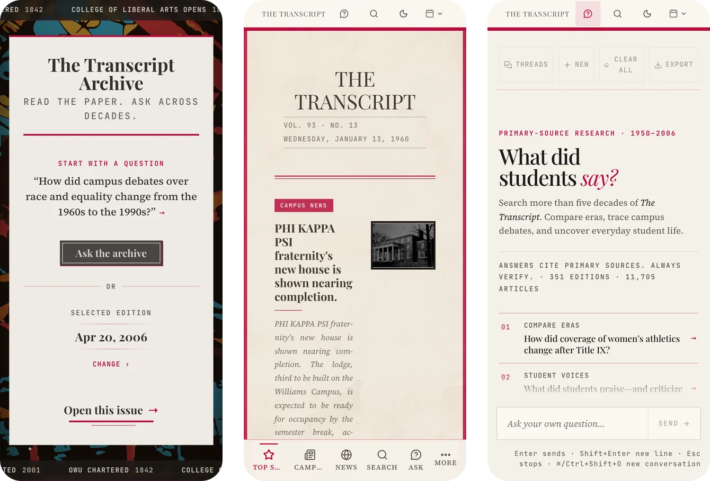
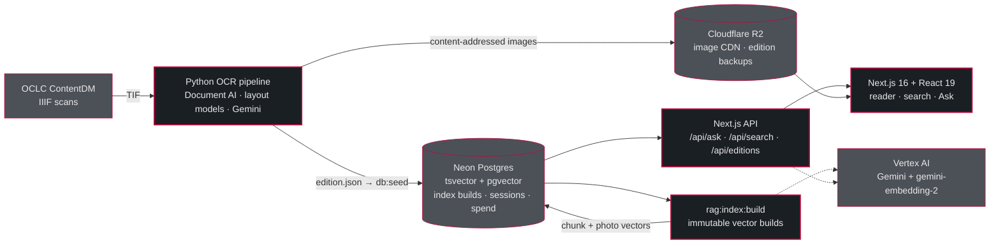

<div align="center">



# The Transcript Archive

**AI-powered searchable archive of Ohio Wesleyan University's student newspaper — half a century of print editions (1950–2006) turned into a multimodal RAG research tool.**

[](https://nextjs.org)
[](https://react.dev)
[](https://www.typescriptlang.org)
[](https://python.org)
[](https://github.com/pgvector/pgvector)
[](https://ai.google.dev)
[](https://github.com/Bamyani1/interactive-newspaper/actions/workflows/nextjs-ci.yml)
[](./LICENSE)

**[▶ Explore the live demo](https://interactive-newspaper-sable.vercel.app)**

</div>

---

> Status: the reader, search, Ask the Archive, and both data pipelines are deployed on Vercel. Ask serves `versioned` retrieval from one immutable index build (activated 2026-08-03) over `article_chunks` / `article_images`, with every Gemini call on Vertex AI. `legacy` mode survives only as an emergency switch, and one that degrades to keyword-only search ([why](./docs/architecture/rag-pipeline.md#legacy-cutover-behavior)). Explore the [live demo](https://interactive-newspaper-sable.vercel.app), run it locally, or read [`docs/architecture/`](./docs/architecture/) for deep-dives on each subsystem.

---

## Table of Contents

1. [Problem & Solution](#problem--solution)
2. [What It Does](#what-it-does)
3. [Screenshots](#screenshots)
4. [System Architecture](#system-architecture)
5. [Architecture Docs](#architecture-docs)
6. [Tech Stack](#tech-stack)
7. [The RAG Pipeline](#the-rag-pipeline)
8. [The OCR Pipeline](#the-ocr-pipeline)
9. [Multimodal Image Embedding](#multimodal-image-embedding)
10. [Database Schema](#database-schema)
11. [Reliability & Hardening](#reliability--hardening)
12. [Testing Strategy](#testing-strategy)
13. [Getting Started](#getting-started)
14. [Environment Variables](#environment-variables)
15. [Commands](#commands)
16. [Project Structure](#project-structure)
17. [Conventions](#conventions)
18. [Skills Demonstrated](#skills-demonstrated)
19. [Contributing](#contributing)
20. [License](#license)
21. [Acknowledgements](#acknowledgements)

---

## Problem & Solution

Ohio Wesleyan University's student newspaper, _The Transcript_, has been published weekly since 1867. Decades of print editions from the late 20th century exist only as bulk scanned TIF files in the OCLC ContentDM archive — unsearchable, unstructured, and effectively invisible to anyone who didn't know the exact date they were looking for.

**The goal:** turn half a century of print history into a searchable, queryable, AI-augmented research tool that anyone can use to ask natural-language questions about campus life from 1950 through 2006.

**The approach, end-to-end:**

1. **Ingest** raw TIF scans from the ContentDM IIIF archive (custom discovery and download tools in `scripts/iiif/`).
2. **OCR** each page through a Python pipeline combining Google Document AI Enterprise OCR (page text with token confidence), a hybrid visual detector (the American Stories newspaper-layout model for photos, cartoons and ads, plus DocLayout-YOLO for tables), and Google Gemini (structuring articles, headlines, bylines and ads, and deciding what each detected visual is).
3. **Merge** articles that span multiple pages, review every page seam, enrich ads with structured metadata, then validate and atomically publish the edition with its images on Cloudflare R2.
4. **Store** the structured output in Neon Postgres with `tsvector` full-text search, then build an immutable index of 768-dim `pgvector` embeddings: sentence-aware text chunks plus one multimodal vector per photo.
5. **Serve** a Next.js 16 application with a period-accurate reading UI, keyword search, and an "Ask the Archive" research workspace powered by a full RAG pipeline that routes complex questions to a function-calling agent.
6. **Search multimodally** — text queries match text chunks; visual queries (e.g., "show me protest photos") match per-photo vectors and captions in the same embedding space.

**Scale today:** 351 editions (3,099 pages, 1950-01-11 through 2006-04-20); 11,705 articles indexed as 13,143 sentence-aware text chunks plus 2,875 photo vectors (768-dim `gemini-embedding-2`); 6,846 ads, 6,804 of them enriched with structured metadata; 57 year digests for survey questions; an offline Ohio weather archive covering 1950–2000 (18,628 daily entries); and a monthly US top-10 music archive for 1958–2010 (6,290 chart entries across 629 months).

---

## What It Does

- **Browse the archive.** Read digitized editions with period-accurate typography, section navigation, an edition picker, and date controls; `/edition` opens the latest issue.
- **Search.** `/search` runs full-text search with category and date-range filters and highlighted snippets.
- **Ask the Archive.** Natural-language research over the archive with a full RAG pipeline: query reformulation, hybrid vector + full-text retrieval, Gemini reranking with a corrective retry, cited answer generation, and streaming SSE responses.
- **Complex questions get an agent.** Multi-era, comparative, or multi-hop questions go to a Gemini function-calling agent with `search_archive`, `read_article`, and `list_editions` tools instead of the linear pipeline.
- **Answers you can check.** Each answer carries source cards with an in-page article reader, a coverage note on what was searchable, a low-confidence caveat when evidence is thin, follow-up suggestions, and copy / rate / re-run controls.
- **Multi-thread conversations.** Turns persist to Neon (5 turns of prompt context; rows kept `ASK_SESSION_TTL_DAYS`, default 7). Past threads are kept in the browser and can be renamed or deleted; on phones the archive opens as a bottom sheet. Follow-up questions carry context.
- **Export a conversation.** Any Ask thread exports to a formatted PDF client-side (`jspdf` + `html2canvas`).
- **Budget-aware by default.** A per-environment daily spend cap (`RAG_DAILY_BUDGET_USD`, default $2) refuses new questions before a runaway loop can run up the Vertex AI bill.
- **Multimodal visual queries.** "Show me protest photos" searches per-photo vectors and captions, inlines up to three grounded photos in the answer, and lists the rest in a "More pictures" grid with a full-screen lightbox.
- **End-to-end OCR pipeline.** A five-stage Python pipeline turns raw TIF scans into a validated `edition.json`: Document AI OCR, hybrid visual detection, Gemini page structuring and visual assignment, edition-wide article grouping with seam review, ad enrichment, and a targeted final review. A shell wrapper then uploads content-addressed images to R2 and atomically promotes the edition.
- **Historical context.** The reader's sidebar shows that day's Delaware, Ohio weather (offline archive for 1950–2000, live NOAA/Open-Meteo lookup beyond it) and that month's US top-10 songs (1958–2010) with an embedded player.
- **Light and dark themes**, applied before first paint, plus mobile-specific navigation and Ask actions. The landing page's daily question deep-links into Ask.

---

## Screenshots

<div align="center">

**Ask the Archive — research workspace with thread archive and suggested comparisons**

<picture>
  <source media="(prefers-color-scheme: dark)" srcset="./public/readme/ask-dark.webp" />
  
</picture>

<br/><br/>

**Edition reader — January 13, 1960**

<picture>
  <source media="(prefers-color-scheme: dark)" srcset="./public/readme/edition-dark.webp" />
  
</picture>

<br/><br/>

**On a phone — landing, reader, and Ask**

<picture>
  <source media="(prefers-color-scheme: dark)" srcset="./public/readme/mobile-dark.webp" />
  
</picture>

</div>

---

## System Architecture


```mermaid
flowchart LR
  classDef brand fill:#1A1F24,stroke:#B80D3E,color:#E8E8E8,stroke-width:2px
  classDef data fill:#4C5158,stroke:#B80D3E,color:#E8E8E8,stroke-width:1px

  IIIF["OCLC ContentDM<br/>IIIF scans"]:::data
  OCR["Python OCR pipeline<br/>Document AI · layout models · Gemini"]:::brand
  R2[("Cloudflare R2<br/>image CDN · edition backups")]:::data
  DB[("Neon Postgres<br/>tsvector + pgvector<br/>index builds · sessions · spend")]:::data
  IDX["rag:index:build<br/>immutable vector builds"]:::brand
  AI["Vertex AI<br/>Gemini + gemini-embedding-2"]:::data
  API["Next.js API<br/>/api/ask · /api/search · /api/editions"]:::brand
  UI["Next.js 16 + React 19<br/>reader · search · Ask"]:::brand

  IIIF -- "TIF" --> OCR
  OCR -- "content-addressed images" --> R2
  OCR -- "edition.json → db:seed" --> DB
  DB --> IDX
  IDX -- "chunk + photo vectors" --> DB
  IDX -.-> AI
  DB --> API
  API -.-> AI
  API --> UI
  R2 --> UI
```

**Six cooperating blocks:**

1. **Frontend.** Next.js App Router with server components, streaming API routes, and feature modules in `src/features/` (`news-feed`, `ask-archive`, `search`, `archive`, `time-controls`, `navigation`, `music-player`, `weather`, `context-panel`, `footer`, `theme`). Cross-feature imports are avoided by convention; the sidebar, time-controls, and edition-footer modules compose other features.
2. **API layer.** Server routes in `src/app/api/`. `POST /api/ask` runs the RAG pipeline (SSE with `?stream=1`, which the UI uses, or JSON for the evaluation harness). `GET`/`DELETE /api/ask/session` rehydrate or delete a thread's server-side history; `POST /api/ask/feedback` records ratings. `GET /api/editions` and `/api/editions/[date]` serve edition data; `/api/search` and `/api/weather` back the search page and sidebar; `/api/admin/revalidate` flushes the editions cache; `/api/internal/retention` is the nightly Vercel cron.
3. **Database.** Neon serverless Postgres, schema from 12 numbered migrations. Content (`editions`, `articles`, `ads`, `weather`, `music`); retrieval (`article_chunks`, `article_images` with HNSW indexes, scoped to an immutable `rag_index_builds` row, plus `year_digests`); runtime (`ask_session_turns`, `ask_feedback`, `ai_spend_by_scope`, `api_rate_bucket`); and publication and identity tables for offline tooling.
4. **OCR pipeline.** Python 3.12 domain-driven package with AST-enforced import boundaries. Five stages, parallel per page for stages 1–2; a shell wrapper owns validation, R2 upload, and atomic promotion.
5. **Ops scripts.** Node and shell scripts for migrations, seeding, versioned RAG index builds and health checks, R2 upload/GC and edition backups, OCR orchestration, evaluation, and the weather archive.
6. **Image CDN.** Cloudflare R2 hosts content-addressed `.webp` images (`ocr-assets/<sha256>.webp`) in production via `IMAGE_BASE_URL`, with a local API proxy in dev. The same bucket holds the edition JSON backups.

---

## Architecture Docs

For production-level deep-dives on each subsystem — intended for contributors and senior engineers reviewing the code:

- **[docs/architecture/README.md](./docs/architecture/README.md)** — reading order, glossary, and troubleshooting shortcuts
- **[docs/architecture/ocr-pipeline.md](./docs/architecture/ocr-pipeline.md)** — stage-by-stage OCR design, manifest accounting, Gemini request policy, asset publication, failure logging
- **[docs/architecture/rag-pipeline.md](./docs/architecture/rag-pipeline.md)** — `/api/ask` end-to-end: simple pipeline, agent loop, streaming, dedup, budget, error taxonomy
- **[docs/architecture/data-model.md](./docs/architecture/data-model.md)** — schema, `edition.json` contract, embeddings and index builds, HNSW, migrations, the ocr-adapter boundary

The three deep-dives cross-reference each other and share a glossary. Read them in order if you're new.

---

## Tech Stack

**Frontend**

- Next.js 16.3 (App Router) · React 19.3 · TypeScript 5
- Tailwind CSS 4.3 with a token-based design system (`src/styles/tokens/`, mirroring [`design.md`](./design.md)) and shared primitives in `src/components/ui/primitives/`
- Framer Motion 12 (`LazyMotion`, honours reduced motion) for edition swaps, navigation, time controls, and the lightbox
- `react-markdown` + `remark-gfm` for chat answers, `sanitize-html` for search snippets, `jspdf` + `html2canvas` for PDF export, `lucide-react` icons
- Playfair Display, Source Serif 4, and JetBrains Mono via `next/font/google`

**Backend**

- Next.js API routes (Node.js runtime) and a middleware CSP + rate limiter
- Neon Postgres (serverless) with `pgvector` HNSW and `tsvector` full-text search
- Cloudflare R2 for image hosting and edition backups (AWS SDK v3)
- Vitest + PGlite (TypeScript), Playwright (browser), and pytest (Python) for testing

**AI / Machine Learning**

- **Google Gemini** (`@google/genai`) — answers and reranking on `gemini-3.6-flash`, query reformulation on `gemini-3.5-flash-lite`, and 768-dimensional `gemini-embedding-2` vectors, plus the independently configured OCR stages. Vertex AI everywhere: ADC locally and for the data pipeline, a service account (`GOOGLE_SERVICE_ACCOUNT_JSON`) on the Vercel serving runtime (production and previews). There is no API-key mode: without `GOOGLE_CLOUD_PROJECT` every Gemini client refuses to start.
- **Google Document AI** — Enterprise OCR processor for page text with token-level confidence
- **American Stories layout model + DocLayout-YOLO** — hybrid visual detector: the American Stories ONNX checkpoint finds photos, cartoons, and ads; DocLayout-YOLO adds tables it missed

**Python OCR Pipeline**

- Python 3.12, `ocr/src/transcript_ocr/` package
- Domain-driven layout with eleven domain layers (`application/`, `recognition/`, `preprocessing/`, `detection/`, `merging/`, `postprocessing/`, `image_linking/`, `export/`, `evaluation/`, `diagnostics/`, `ingestion/`) plus infrastructure (`contracts/`, `shared/`, `config/`, `cli/`)
- Import-boundary and architecture tests enforced in CI (`.github/workflows/ocr-architecture.yml`); the rest of `tests/ocr/` runs locally

---

## The RAG Pipeline

`POST /api/ask` is the single endpoint that runs retrieval-augmented generation. Two paths share the same guards:

```
Simple pipeline:  reformulate → retrieve (vector ∥ FTS → RRF) → rerank (+ CRAG retry) → generate
Agent loop:       reformulate → agent[search/read/list] → synthesize
```

The reformulator classifies the question as `simple` or `complex`; simple questions run the linear pipeline, complex questions go straight to the agent. Questions about absence, counts, or exhaustive coverage add a coverage step to either path. Both paths stream SSE (`?stream=1`) or return plain JSON.

For the full end-to-end deep-dive — error taxonomy, dedup, agent tool interface, confidence thresholds, and the operator runbook — see **[docs/architecture/rag-pipeline.md](./docs/architecture/rag-pipeline.md)**. What follows here is a summary.

### Query reformulation

Modern user queries don't match 1960s newspaper language. "What did students think about the Vietnam War?" against text that uses "the war in Indochina" or "the conflict in Southeast Asia" hurts both vector and FTS retrieval.

`query-reformulator.ts` uses Gemini to rewrite the question into period-appropriate vocabulary, detect text-vs-visual intent, produce separate `embeddingQuery` and `ftsQuery` outputs, infer database date filters only from explicit years/decades/ranges, and classify complexity. Semantic expansion stays in `embeddingQuery`; `ftsQuery` is deliberately limited to 1–3 essential names/nouns with no generated `OR` chain. Broad one-topic synthesis remains on the simple path. It also tags coverage intent (absence/count/exhaustive) and, for explicit comparisons, each period. If the rewrite fails or exceeds 8 s, the original question drives the vector leg, FTS gets a locally derived keyword set, the question stays simple, and the response carries `meta.reformulationDegraded`.

### Embedding & retrieval

`embeddings.ts` produces 768-dimensional query vectors with `gemini-embedding-2`, with a five-minute per-instance LRU. Ask searches only the active index build: deterministic overlapping text chunks in `article_chunks` and one vector per photo in `article_images`. `retrieval.ts :: retrieveCandidates` runs HNSW vector and chunk-aware FTS retrieval as two independent legs, then merges them with Reciprocal Rank Fusion (k = 40) using mode-specific weights (0.7/0.3 for visual, 0.6/0.4 for text). The judge chooses from 40 fused candidates (50 visual); up to 12 sources (15 visual) reach the answer. Date ranges of 90 days or more use month-stratified vector selection so a survey covers the whole range. Each leg's raw result stays inspectable, so `meta.method` reports what actually produced the candidates — `hybrid`, `fts`, `vector`, or `none` when both legs succeeded and returned nothing.

`npm run rag:health` is the read-only check for the retrieval identity itself: it reports the index-build readiness predicates individually, the embedding stamps actually present on the served tables, and the serving `WHERE` clause run as a `COUNT`. A count of zero there means the serving filter matches no rows — the vector leg goes dark without raising an error.

### Reranking with CRAG

Retrieved articles go to Gemini with explicit score anchors (0–10). Scores ≥4 (text) / ≥3 (visual) survive. The judge receives matched passages and image captions; it treats evidence that corrects a false premise as relevant, and in visual mode distinguishes a relevant pictured subject from an article that merely mentions that subject beside an unrelated image. On zero-result ranking, **one corrective retrieval retry** runs with broader search terms — a single-pass CRAG — and re-ranks at ≥3 (text) / ≥2 (visual). If a text search is still vetoed, the top fused candidates go forward at the neutral score 5; a vetoed photo search returns no images. The judge has 12 s and re-judges the top half of the pool once on timeout. Setting `VOYAGE_API_KEY` swaps in a Voyage `rerank-2.5` cross-encoder, falling back to Gemini on any failure.

### Answer generation

The answer generator receives the **original** user question plus the matched passages from reranked articles. A skip-Gemini guard fires when the mean of the three best reranker scores is below 5, so a tally across many partial sources is not refused. The output ceiling leaves room for the thinking budget plus the structured JSON answer, and malformed structured envelopes are never shown as raw UI text. Confidence is based on verified visible citations and the model-independent 0–10 reranker rubric, not embedding-distance constants.

### Agent loop for complex questions

`agent-loop.ts` — constrained Gemini function-calling loop with three tools (`search_archive`, `read_article`, `list_editions`). It permits at most three tool rounds, then makes one mandatory synthesis call under a dedicated final-answer instruction with function calling explicitly set to `NONE`. The final call starts fresh from a deduplicated packet of returned article evidence, avoiding prior tool-call turns that can condition the model to keep searching. It is AbortSignal-aware and backed by the same canonical retrieval/reranking/CRAG service as the simple path. Research stops before a new round when fewer than 20 s remain before the deadline, so synthesis always has time to write; every round streams.

### Conversation threading

`conversation-store.ts` persists turns to Neon `ask_session_turns` (5 turns of prompt context; rows kept `ASK_SESSION_TTL_DAYS`, default 7; session ids stored as SHA-256 hashes). `persistTurnBounded` caps the write at 1500 ms so a slow DB never stutters the final `done` event. The sidebar lists the active thread and archived threads from localStorage; threads can be renamed. "New conversation" mints a fresh session; deleting a thread or "Clear all threads" also deletes its Neon rows.

### Guards

- **Rate limiting**: `middleware.ts` applies per-IP limits to every `/api/*` route — 10 req/min on `/api/ask`, 20 on `/api/search`, 120 elsewhere — Neon-backed with an in-memory fallback. Session, feedback, editions, weather, revalidate, and retention routes add their own tighter limits.
- **Daily budget**: `RAG_DAILY_BUDGET_USD` (default $2, clamped to $50) per environment (`VERCEL_ENV`, else `local`) via the `ai_spend_by_scope` table (`cost-tracker.ts`), so local testing never spends production's budget. If Neon can't be read, requests continue until estimated blind spend reaches $0.50.
- **Concurrent dedup**: identical in-flight (ip, question, filters, sessionId) requests share one pipeline run (JSON path only)
- **Global deadline**: `GLOBAL_DEADLINE_MS = 55_000`; all stages race against it
- **No answer cache**: every question runs the full pipeline; only query embeddings are cached (5 min, 100 entries, per instance)
- **Prompt-injection defense**: user questions are encoded as JSON strings, model outputs use schemas, and citations are accepted only for evidence actually returned by retrieval/tools

---

## The OCR Pipeline

The pipeline is a Python 3.12 package at `ocr/src/transcript_ocr/`, organized by domain responsibility. A CI-enforced architecture test fails the build if any module violates the dependency direction:

```
application → (recognition | preprocessing | detection | merging |
               postprocessing | image_linking | export | diagnostics | ingestion)
            → (contracts | shared | config)
```

No stage layer can import `application`; `contracts` and `shared` can't import `application` or the processing stages. The `evaluation/` layer is offline analysis outside the runtime chain and may never import `application`. AST-based static checks live in `tests/ocr/architecture/`.

For the stage-by-stage design, manifest accounting, Gemini request and retry policy, asset publication, and failure logging, see **[docs/architecture/ocr-pipeline.md](./docs/architecture/ocr-pipeline.md)**.

### Stages

| Stage   | Purpose                                                                                     | Output                                                 |
| ------- | ------------------------------------------------------------------------------------------- | ------------------------------------------------------ |
| 0       | IIIF manifest inventory; lossless TIFF → PNG, every frame pixel-verified                    | one expected entry per canvas                          |
| 1       | Per page: color source master + grayscale OCR derivative; Document AI OCR; hybrid detection | paragraphs + token confidence; visual regions          |
| 2       | Per page: Gemini page structuring + visual assignment                                       | articles, ads, other content; a disposition per region |
| gate    | At least 70% of manifest canvases must pass                                                 | publish or abort                                       |
| 3       | Edition-wide article grouping + all-boundary seam review                                    | lossless cross-page merges; candidate `edition.json`   |
| 4       | Ad enrichment + targeted final type/category review                                         | source-grounded ad fields; high-confidence fixes only  |
| 5       | Validate, write provenance, summary                                                         | `edition.json` + `provenance.json` candidate           |
| publish | Shell wrapper: validate → upload images to R2 → validate → atomic promotion                 | `public/editions/<date>/` + `asset-manifest.json`      |

### Gotchas worth knowing

- **Retry identity**: OCR retries keep the same stage model and configuration; see the OCR architecture document for its independently locked routing.
- **70% publication gate**: every IIIF canvas ends `passed_content`, `passed_visual`, `confirmed_blank`, or `failed`; an edition publishes only if at least 70% pass, and a failed cloud call is never counted as blank.
- **Atomic writes and locks**: every candidate file is written to a temp file and committed with `os.replace`; the wrapper holds a per-date lock and a shared asset lock (also taken by R2 GC), so two runs never touch the same edition.
- **Scans are kept until publication**: the wrapper deletes an inbox folder only after the edition is promoted, so a failed run can simply be retried.

More detail: [docs/architecture/ocr-pipeline.md](./docs/architecture/ocr-pipeline.md).

---

## Multimodal Image Embedding

The goal: _"show me photos of the homecoming parade"_ should actually surface the photos — not just text hits that happen to mention homecoming.

### Embed-time

`npm run rag:index:build` (`scripts/db/build-rag-index.mjs`) creates an immutable index build and fills it with `gemini-embedding-2` vectors: sentence-aware text chunks in `article_chunks`, and one multimodal vector per image (read from R2) in `article_images`. A build is finalized, then activated, and serving names it in `RAG_ACTIVE_INDEX_BUILD_ID`. This keeps late-article facts retrievable and prevents a primary image from diluting the article's only text vector.

### Query-time

When the reformulator flags a query as visual:

- Hybrid search queries `article_images` directly and increases the candidate limit.
- The reranker receives image captions and scores whether the pictured subject—not merely article prose—matches the request.
- The response carries `mode: "visual"` and up to 15 reranked sources, each with `imageUrls[]`/`imageCaptions[]` led by the image that matched; the answer may inline at most three images, each tied to a cited source and captioned from the stored caption.

### Rendering

`Turn.tsx` renders grounded inline images in the answer (`InlineAnswerImage`); visual-mode turns add a "More pictures" grid (`PhotosPanel.tsx`) of the remaining source photos, opening in a lightbox.

---

## Database Schema

Designed for Neon serverless Postgres. Canonical DDL lives in [scripts/db/migrations/](./scripts/db/migrations) (`0001`–`0012`, applied with `npm run db:migrate`); column-by-column details in [docs/architecture/data-model.md](./docs/architecture/data-model.md).

```sql
-- Core content, written by db:seed from public/editions/<date>/edition.json
editions (date PK, publication_info, page_count, article_count)

articles (
  id PK,                                -- '{date}-{index}'
  edition_date FK,
  position, category, headline, summary, full_text, body_plain, byline, page,
  writer_position, is_hero, is_featured,
  image_urls JSONB, image_caption, image_captions JSONB,
  search_vector TSVECTOR,               -- trigger-maintained
  embedding VECTOR(768),                -- legacy; read only when RAG_RETRIEVAL_MODE=legacy
  embedding_model, embedding_input_hash, embedding_input_version
)

ads     (id PK, edition_date FK, position, title, body, category, ad_type,
         display_text, phone, address, price, image_urls JSONB)
weather (date + scope PK, tmax_c, tmin_c, precip_mm, source, source_station_id,
         quality_flag, is_estimated)
music   (year + month + rank PK, title, artist, youtube_id)

-- RAG evidence; Ask serves only rows of the active build
rag_index_builds (id PK, corpus_version, status, pipeline_version, embedding_model,
                  text_embedding_input_version, image_embedding_input_version,
                  created_at, validated_at, activated_at, failure_reason)
article_chunks (id PK, index_build_id FK, article_id FK, chunk_index, chunk_text,
                search_vector, embedding VECTOR(768), embedding_model,
                embedding_input_version, embedding_input_hash)
article_images (id PK, index_build_id FK, article_id FK, image_index, image_url,
                caption, embedding VECTOR(768), embedding_model,
                embedding_input_version, embedding_input_hash)
corpus_versions (id PK, manifest_hash, edition_count, article_count, ad_count, …)
year_digests    (year PK, digest, article_count, model, generated_at)

-- Runtime
ask_session_turns (id, session_id /* SHA-256 */, question, answer,
                   cited_article_ids, citation_snapshots JSONB, created_at)
ask_feedback      (id, request_id, question, answer, confidence, mode, citations,
                   vote, comment, created_at)
ai_spend_by_scope (day + scope PK, spent_usd, updated_at)   -- daily AI budget per environment
api_rate_bucket   (key PK, count, expires_at, created_at)    -- sliding window

-- Also present: schema_migrations (ledger); identity, revision, publication and
-- asset-registry tables for offline tooling (source_records, issues,
-- edition_revisions, content_items, content_revisions, assets, asset_references, …);
-- and two retired runtime tables (ai_spend_counter, answer_cache)
```

Indexes:

- B-tree on `articles.edition_date`, `articles.category`, `articles.byline (WHERE NOT NULL)`, `ads.edition_date`
- GIN on `articles.search_vector`, `article_chunks.search_vector`, and `to_tsvector('english', article_images.caption)`
- HNSW (`vector_cosine_ops`, `m=16, ef_construction=128`) on `article_chunks.embedding`, `article_images.embedding`, and the legacy `articles.embedding`; versioned queries run `hnsw.ef_search=100` plus `iterative_scan='relaxed_order'`
- Partial unique indexes key unversioned rows and build rows separately; one `active` build per `corpus_version`

Plpgsql triggers maintain `articles.search_vector` (headline A > summary B > byline = body_plain C) and an unweighted `article_chunks.search_vector`.

### Embedding identity

Ask serves vectors only from an immutable index build: `article_chunks` / `article_images` rows stamped with `index_build_id`, written by `npm run rag:index:build` and frozen once the build leaves `building`. Each vector records its model, input version, and a SHA-256 fingerprint of model, version, exact text, and (for images) bytes. A changed input, model, or version means a new build, not an in-place update. `db:seed` maintains a separate set of unversioned rows (`index_build_id IS NULL`) that no query reads. See [data-model.md § Embeddings](./docs/architecture/data-model.md#embeddings).

---

## Reliability & Hardening

A representative sample of commits that each address a real failure mode discovered during development, not speculative defensive programming:

| Commit    | Area                    | What was wrong                                                                                                                                                |
| --------- | ----------------------- | ------------------------------------------------------------------------------------------------------------------------------------------------------------- |
| `141365c` | Rate limiting           | `/api/ask` had no rate limiter; a single user could exhaust the Gemini quota in minutes. Now 10 req/min per IP, durable.                                      |
| `492dcfb` | Prompt injection        | User input was interpolated raw into the generator prompt. Current prompts encode questions as JSON strings and validate structured responses/citations.      |
| `aee32fa` | Token limits            | Long articles could push embedding input past the token cap. Now a pre-flight count trims at a sentence boundary.                                             |
| `1f0d26c` | FTS correctness         | Article updates left `search_vector` stale. Added a plpgsql trigger that auto-maintains on INSERT/UPDATE.                                                     |
| `6365024` | Retry backoff           | Backoff was indexed by batch position rather than retry count. Fixed.                                                                                         |
| `1bfaef6` | Fallback timeouts       | Retrieval could orphan work after a deadline. Neon fetches now receive real cancellation, and timeout/abort never starts a second fallback query.             |
| `ce34dc5` | Reranker parsing        | Reranker rejected decimal scores (`9.5`). Now parses floats.                                                                                                  |
| `025a9e2` | Ad deduplication        | Restoring locked editions double-inserted ads. Added dedup on restore.                                                                                        |
| `837198d` | Conversation durability | `done` event could fire before the turn was persisted. Added `persistTurnBounded` 1.5s cap.                                                                   |
| `331e31c` | History truncation      | Long answers bloated `ask_session_turns`. Now capped at 8000 chars with a truncation marker.                                                                  |
| `976b61a` | Reranker bounds         | Reranker fallback could exceed `maxArticles`. Capped.                                                                                                         |
| `d051dcd` | Cache correctness       | The answer cache served context-flavored answers across sessions. It was first bypassed when history was non-empty, then removed entirely (`243f9d0`, below). |
| `243f9d0` | Answer privacy          | The semantic answer cache matched paraphrases at 0.94 similarity and could serve one reader another's answer. Every question now runs the full pipeline.      |
| `d932969` | Billing isolation       | Serving used Gemini API keys billed to prepaid credits, and production failed when they ran out. Every call now runs on Vertex with a service account.        |
| `e2b34f1` | Budget isolation        | Local testing and production shared one daily spend counter. Spend is now scoped per environment.                                                             |
| `88560b7` | Agent deadline          | The agent kept researching until too little time remained to write the answer. It now stops before a new round when fewer than 20 s remain.                   |
| `9a3a3c1` | Scan safety             | The OCR wrapper deleted inbox scans even when a run failed before publishing. Scans are now removed only after the edition is promoted.                       |
| `e28f60e` | Index-build safety      | A full seed or backfill deleted chunk and image rows that belonged to the active index build. Both now touch only rows outside any build.                     |

Every pipeline step has a timeout and a typed error envelope with a `kind` discriminator. Answers and reranking run on Gemini 3.6 Flash; only query reformulation uses Flash-Lite, and retries never change the stage model.

---

## Testing Strategy

### TypeScript (Vitest)

About 125 Vitest files:

- **Lib tests** (`tests/lib/`) — one suite per `src/lib` service: retrieval, reranker, agent loop/tools, answer generation and grounding, cost tracker, rate limit, retention, SSE protocol
- **API tests** (`tests/api/`) — `ask-route.test.ts` (100+ cases) covers the full `/api/ask` pipeline, streaming, dedup, regenerate, and the error taxonomy with mocked Gemini; plus session, feedback, editions, search, weather, and retention routes
- **Golden RAG regression** — opt-in (`RUN_RAG_GOLDEN=1`) `rag-golden-questions.test.ts` against the real DB and Gemini; frozen source/fact and security assertions decide correctness, while citation-count/confidence drift is reported as telemetry
- **Database tests** (`tests/db/`) — migrations, seed, publisher state machine, index builds, and backups on in-memory PGlite
- **Component tests** — React Testing Library + jsdom across `ask-archive`, `news-feed`, `components`, `search`, `theme`, `time-controls`, `music`, `footer`, `edition-picker`
- **Runner** — `npm run test:run` (CI) or `npm test` (watch)

### Browser (Playwright)

- `tests/e2e/smoke/` — landing, Ask workspace, edition reader, keyboard popups, scroll restoration
- `tests/e2e/audit/` — screenshots with axe WCAG 2.1 AA checks, breakpoints, transitions, and a full edition sweep
- Projects `chromium-desktop` and `chromium-mobile`, plus Firefox and WebKit smoke runs; `npm run test:e2e`

### Python (pytest)

31 test files in `tests/ocr/`:

- **Unit** — merging, null sanitizing, image conversion, byline cleanup, asset policy
- **DocAI / preprocessing** — provider, image preparation, page quality, region filters
- **Failure paths and shell orchestration** — static checks of the wrapper's failure handling
- **Architecture / import-boundary tests** (run in CI) — `tests/ocr/architecture/`
- **Setup** — `source ocr/.venv/bin/activate && pip install pytest` (pytest is not in `ocr/requirements.txt`)

### CI

- `.github/workflows/nextjs-ci.yml` (Node 24) — **verify:** `npm ci`, `tsc --noEmit`, `npm run test:typecheck`, ESLint, Vitest on every PR and push to `main`. **e2e** (only when the `CI_DATABASE_URL` secret exists; fork and Dependabot PRs skip it): a production build, then the Playwright specs on `chromium-desktop` and `chromium-mobile` against a frozen copy of the database. The specs mock the `/api` calls they exercise, so no AI credentials are needed.
- `.github/workflows/ocr-architecture.yml` (Python 3.12) — AST import-boundary, wrapper-entrypoint, and runtime-cutover tests in `tests/ocr/architecture/`, plus a check that the OCR entry scripts and shell wrappers exist.

---

## Getting Started

**Prerequisites:** Node.js 24+ with npm, Python 3.12 (for OCR), a Neon Postgres database (or any Postgres with `pgvector`), a Google Cloud project with billing, Vertex AI, and Document AI enabled, and working Application Default Credentials.

```bash
# 1. Clone and install
git clone https://github.com/Bamyani1/interactive-newspaper.git
cd interactive-newspaper
npm ci

# 2. Configure
cp .env.example .env.local      # DATABASE_URL, GOOGLE_CLOUD_PROJECT, GOOGLE_CLOUD_LOCATION=global
gcloud auth application-default login
npm run google:verify-adc       # read-only check of ADC, project, APIs, and the OCR processor

# 3. Create the schema and load data
npm run db:migrate                      # applies scripts/db/migrations/ (creates every table)
npm run editions:backup -- --restore    # edition JSON isn't committed; restores it from R2 (needs R2_*)
npm run db:seed                         # upserts editions, articles, ads, weather, music

# 4. Run the app
npm run dev                     # http://localhost:3000
```

Edition data (`public/editions/`) is not in the repository. Without access to the R2 backup, produce editions with the OCR pipeline below. Point `IMAGE_BASE_URL` at the R2 CDN, since the backup holds JSON only. `db:seed` never embeds; new editions reach Ask through an index build.

The reader and search work once the data is seeded. Ask's vector search also needs an index build:

```bash
npm run rag:index:build -- --dry-run --yes                       # read-only plan and cost
npm run rag:index:build -- --create --corpus <corpus-id> --yes   # prints <build-id>
for step in populate embed-text embed-images finalize activate; do
  npm run rag:index:build -- --$step <build-id> --yes
done
# .env.local: RAG_RETRIEVAL_MODE=versioned, RAG_ACTIVE_INDEX_BUILD_ID=<build-id>, RAG_CORPUS_VERSION=<corpus-id>
npm run rag:health
```

### OCR Pipeline (processing new scans)

```bash
# One-time Python setup (Python 3.12)
cd ocr
python3.12 -m venv .venv && source .venv/bin/activate
pip install -r requirements.txt
cd ..

# .env.local also needs DOCUMENT_AI_PROCESSOR_ID, DOCUMENT_AI_LOCATION,
# OCR_DETECTOR_LICENSES_ACCEPTED=true, and R2_* for the image upload.

# Each edition is a folder in ocr/inbox/ whose name contains YYYY-MM-DD
scripts/ocr/process-edition.sh "ocr/inbox/1988-10-12" --workers 3 --seed
scripts/ocr/process-unprocessed.sh --parallel 2 --workers 3 --seed   # every inbox folder
scripts/ocr/process-unprocessed.sh --dry-run                          # list what would run
```

Each run validates the candidate, uploads referenced images to R2 as `ocr-assets/<sha256>.webp`, validates again, atomically promotes it to `public/editions/<date>/`, and only then deletes the inbox folder; `--seed` upserts that one date into the database. The wrapper activates its own virtualenv and loads `.env.local`. It never embeds, and the batch script does not skip dates that are already published.

**Making new editions live:**

1. `npm run editions:backup` — back up the new `edition.json` files to R2.
2. The editions are now readable and searchable on the site. Ask sees them only after a **new index build** that includes them is created and activated (steps above), followed by updating `RAG_ACTIVE_INDEX_BUILD_ID` and `RAG_CORPUS_VERSION` in Vercel, a redeploy, and `npm run rag:health`.

### IIIF Archive Download (optional)

```bash
cd scripts/iiif
python -m pip install -r requirements.txt    # requests, tqdm, Pillow
python discover.py                            # up to 20 new editions per decade, skipping dates
                                              # already in public/editions/ or ocr/inbox/
python download.py --batch manifests/new_manifests.txt   # TIFs + source-manifest.json → ocr/inbox/
```

`download.py <manifest-url>` fetches a single edition. `extract-manifests.py "<CONTENTdm search URL>" --all` lists every manifest on a search.

### Running migrations

Schema changes live in `scripts/db/migrations/` (`0001`–`0012`) and are applied with `npm run db:migrate`, which records each file in a `schema_migrations` ledger under an advisory lock. Applied migrations are checksum-immutable, so an existing database gets only the pending files. Data commands (`db:seed`, backfills, `rag:index:build`) never run DDL and refuse a database with pending migrations. Ask's vectors come only from an index build, never from migrate or seed. See [data-model.md § Migrations](./docs/architecture/data-model.md#migrations).

---

## Environment Variables

Create `.env.local` from `.env.example`:

| Variable                                                                      | Required            | Purpose                                                                                                                       |
| ----------------------------------------------------------------------------- | ------------------- | ----------------------------------------------------------------------------------------------------------------------------- |
| `DATABASE_URL`                                                                | Yes                 | Neon Postgres connection string                                                                                               |
| `GOOGLE_CLOUD_PROJECT`                                                        | Yes                 | Vertex AI / Document AI project. Required by every Gemini client; without it they refuse to start rather than use an API key  |
| `GOOGLE_CLOUD_LOCATION`                                                       | Optional            | Vertex location; defaults to `global`, which `google:verify-adc` requires                                                     |
| `GOOGLE_SERVICE_ACCOUNT_JSON`                                                 | Yes on Vercel       | Service-account key JSON (raw or base64) for Vertex where there is no ADC; a malformed value throws                           |
| `GOOGLE_ADC_EXPECTED_PRINCIPAL`                                               | Recommended locally | Optional identity assertion used by the read-only ADC preflight                                                               |
| `RAG_RETRIEVAL_MODE`                                                          | Yes                 | `versioned` in production; the code default `legacy` serves keyword-only results                                              |
| `RAG_ACTIVE_INDEX_BUILD_ID`                                                   | Yes with versioned  | The immutable index build Ask serves                                                                                          |
| `RAG_CORPUS_VERSION`                                                          | Yes with versioned  | Must equal the active build's `corpus_version`, or versioned retrieval fails readiness                                        |
| `RAG_DAILY_BUDGET_USD`                                                        | Optional            | Daily AI spend cap per environment (default 2, clamped to 50)                                                                 |
| `ASK_SESSION_TTL_DAYS`                                                        | Optional            | Days conversation turns stay recallable (default 7, clamped 1–30)                                                             |
| `CRON_SECRET`                                                                 | Yes in production   | Bearer token the Vercel cron presents to `/api/internal/retention`; without it the nightly sweep is refused                   |
| `ADMIN_REVALIDATE_TOKEN`                                                      | Optional            | Auth token for `/api/admin/revalidate`                                                                                        |
| `IMAGE_BASE_URL`                                                              | Optional            | R2 public CDN base URL (falls back to a local API proxy in dev)                                                               |
| `R2_ACCOUNT_ID`, `R2_ACCESS_KEY_ID`, `R2_SECRET_ACCESS_KEY`, `R2_BUCKET_NAME` | Scripts only        | Credentials for `images:upload`, `editions:backup`, `rag:index:build --embed-images`, and R2 GC; the web app never reads them |
| `DOCUMENT_AI_PROCESSOR_ID`                                                    | Yes (OCR)           | Document AI OCR processor                                                                                                     |
| `DOCUMENT_AI_LOCATION`                                                        | Yes (OCR)           | Typically `us`                                                                                                                |
| `OCR_DETECTOR_LICENSES_ACCEPTED`                                              | Yes (OCR)           | `true` acknowledges the American Stories and DocLayout-YOLO license terms; the wrapper refuses to start without it            |
| `VOYAGE_API_KEY`                                                              | Optional            | Swaps in the Voyage `rerank-2.5` reranker; falls back to Gemini on any failure                                                |
| `GC_APPROVAL_TOKEN`                                                           | Optional            | Must match `--approval-token` for `images:gc -- --apply`                                                                      |
| `FEEDBACK_RETENTION_DAYS`                                                     | Optional            | Overrides the 90-day `ask_feedback` retention window                                                                          |
| `EVAL_DATABASE_URL`                                                           | Optional            | Separate database for the isolated evaluation harness                                                                         |
| `OCR_WORKERS`                                                                 | Optional            | Parallel page workers for the OCR pipeline (default 1)                                                                        |
| `GEMINI_CALL_SPACING_S`                                                       | Optional            | Minimum gap between OCR Gemini calls (default 0.5)                                                                            |

The OCR pipeline reads several more of its own (`OCR_ENVIRONMENT`, `OCR_FORCE_PLAIN`, `OCR_MIN_TEXT_LENGTH`, `DOCAI_CONFIDENCE_THRESHOLD`, `AMERICAN_STORIES_MODEL_PATH`) — see [`ocr/README.md`](./ocr/README.md).

**Never commit `.env.local`** — it is already in `.gitignore`.

---

## Commands

| Command                                                       | Description                                                                                                                                         |
| ------------------------------------------------------------- | --------------------------------------------------------------------------------------------------------------------------------------------------- |
| **App**                                                       |                                                                                                                                                     |
| `npm run dev`                                                 | Next.js dev server on http://localhost:3000                                                                                                         |
| `npm run build` / `npm start`                                 | Production build / serve it (both need `DATABASE_URL`)                                                                                              |
| `npm run lint`                                                | ESLint (skips `scripts/**`, `ocr/**`)                                                                                                               |
| `npm run typecheck`                                           | `tsc --noEmit` for the app                                                                                                                          |
| **Tests**                                                     |                                                                                                                                                     |
| `npm test` / `npm run test:run`                               | Vitest watch / single run (CI)                                                                                                                      |
| `npm run test:typecheck`                                      | Type-check the test tree                                                                                                                            |
| `npm run test:frontend`                                       | Component and hook suites only                                                                                                                      |
| `npm run test:invariants`                                     | Invariant checks over every local `public/editions/*/edition.json`                                                                                  |
| `npm run test:e2e`                                            | Playwright smoke: Chromium desktop and mobile, Firefox and WebKit                                                                                   |
| `npm run audit:visual` / `audit:transitions`                  | Screenshot and axe audit / route transitions, desktop and mobile                                                                                    |
| `npm run audit:editions`                                      | Sweep every published edition on a production build (slow; not in CI)                                                                               |
| `python -m pytest tests/ocr/ -x`                              | Python OCR suite (activate `ocr/.venv` and `pip install pytest` first)                                                                              |
| **Database**                                                  |                                                                                                                                                     |
| `npm run db:migrate` / `db:migrate:status`                    | Apply / list numbered migrations                                                                                                                    |
| `npm run db:seed`                                             | Upsert editions from `public/editions/` plus weather and music (`-- --date YYYY-MM-DD` for one)                                                     |
| `npm run db:reset`                                            | Truncate re-seedable tables, restore locked editions, re-seed; refuses while a validated or active index build exists unless `--include-rag-builds` |
| `npm run db:retention-sweep -- --yes`                         | Manual retention sweep (production runs it nightly via cron)                                                                                        |
| **RAG index & health**                                        |                                                                                                                                                     |
| `npm run rag:index:build -- <step> --yes`                     | Create, fill, validate, and activate an immutable index build                                                                                       |
| `npm run rag:health`                                          | Read-only check that the configured build is servable                                                                                               |
| `npm run rag:smoke`                                           | Post every landing prompt at a running `/api/ask` (spends budget)                                                                                   |
| `npm run db:export-build-vectors` / `db:import-build-vectors` | Move an index build between databases without re-embedding                                                                                          |
| `npm run db:gc-index-builds -- --list`                        | List builds; `--prune <id> --yes` deletes a superseded one                                                                                          |
| `npm run google:verify-adc`                                   | Read-only ADC, project, API, and OCR-processor check                                                                                                |
| **Assets & backups**                                          |                                                                                                                                                     |
| `npm run images:upload -- --date YYYY-MM-DD`                  | Optimize, content-address, and upload one edition's images to R2                                                                                    |
| `npm run images:gc`                                           | Registry-driven R2 garbage collection (dry run unless `--apply`)                                                                                    |
| `npm run assets:bootstrap`                                    | Build the asset registry from database references and R2 listings                                                                                   |
| `npm run editions:backup`                                     | Back up `public/editions/*/` JSON to R2 (`-- --restore` to recover)                                                                                 |
| **OCR**                                                       |                                                                                                                                                     |
| `scripts/ocr/process-edition.sh <folder>`                     | OCR, upload, and promote one edition                                                                                                                |
| `scripts/ocr/process-unprocessed.sh`                          | Batch-process every edition folder in `ocr/inbox/`                                                                                                  |
| `scripts/ocr/run-gold-regression.sh`                          | Extraction-only regression on the frozen gold source set                                                                                            |
| **Weather**                                                   |                                                                                                                                                     |
| `npm run weather:build:ohio`                                  | Build the 1950–2000 Ohio archive, then verify it                                                                                                    |
| `npm run weather:verify:ohio`                                 | Verify archive integrity                                                                                                                            |

---

## Project Structure

```
.
├── middleware.ts                 # CSP nonce + per-IP /api/* rate limits
├── design.md                     # Design-system source of truth
├── vercel.json                   # Nightly cron → /api/internal/retention
├── src/
│   ├── app/                      # App Router pages + API routes
│   │   ├── page.tsx              # Landing: daily Ask prompt + edition picker
│   │   ├── ask/                  # Ask the Archive workspace
│   │   ├── edition/              # /edition → latest; /edition/[date] reader
│   │   ├── search/               # Full-text search with filters
│   │   ├── about/, contact/      # Static pages
│   │   ├── dev/primitives/       # Primitive gallery (404 in production)
│   │   └── api/                  # ask (+ session, feedback), editions, search,
│   │                             #   weather, admin/revalidate, internal/retention
│   ├── features/                 # archive, ask-archive, context-panel, footer, music-player,
│   │                             #   navigation, news-feed, search, theme, time-controls, weather
│   ├── components/               # Shared UI (@/shared): primitives, lightbox, PageShell,
│   │                             #   landing picker/ticker/background, motion
│   ├── lib/                      # Services — see below
│   ├── server/
│   │   ├── ocr-adapter/          # The only edition.json → DB-row transform
│   │   ├── identity/             # Content-identity keys + ULIDs
│   │   └── publisher/            # Versioned edition publication state machine
│   ├── styles/                   # tokens/ (colors, typography, spacing), base/, components/
│   └── types/                    # Shared TypeScript types
│
├── src/lib/
│   ├── agent-loop.ts             # Gemini function-calling agent (3 tool rounds + synthesis)
│   ├── agent-tools.ts            # search_archive, read_article, list_editions
│   ├── answer-generator.ts       # Cited answer generation (JSON + streaming)
│   ├── answer-grounding.ts       # Binds answers to cited sources and images
│   ├── answer-stream-extractor.ts# Streams the answer field out of partial JSON
│   ├── article-chunking.ts       # Sentence-aware chunk records
│   ├── ask-dedup.ts              # Coalesces identical concurrent requests
│   ├── ask-limits.ts             # Question limits shared by composer and route
│   ├── ask-stream-events.ts      # /api/ask SSE protocol types
│   ├── citation-snapshot.ts      # Bounded source snapshots stored per turn
│   ├── conversation-store.ts     # Neon-backed session turns
│   ├── cost-tracker.ts           # Token→USD accounting + daily budget kill switch
│   ├── db-timeout.ts             # Driver-free DB timeout race
│   ├── db.ts                     # FTS, vector search, RRF fusion, edition queries
│   ├── editions-server.ts        # Cached edition list + prod DB-outage guard
│   ├── embeddings.ts             # gemini-embedding-2 text/image vectors + LRU
│   ├── gemini-client.ts          # Lazy Vertex client (requires GOOGLE_CLOUD_PROJECT)
│   ├── gemini-quota.ts           # Quota-exhaustion detection and messaging
│   ├── query-reformulator.ts     # Era-aware expansion + intent classification
│   ├── rag-coverage.ts           # Coverage notes for absence/count/exhaustive questions
│   ├── rag-index-config.ts       # Retrieval mode + active index build
│   ├── rag-model-config.ts       # Per-stage model + thinking-level routing
│   ├── rate-limit.ts             # Neon + in-memory sliding window
│   ├── reranker.ts               # LLM reranker + graceful fallback
│   ├── retention.ts              # Retention sweep for runtime tables
│   ├── retrieval.ts              # Canonical retrieve/rerank/CRAG service
│   ├── weather.ts                # NOAA/ACIS/Open-Meteo live lookup
│   └── …                         # image URLs, masthead parsing, gold fallback, evaluation, telemetry
│
├── ocr/
│   ├── src/transcript_ocr/       # Domain-driven package (see docs/architecture/ocr-pipeline.md)
│   ├── src/prompts.json          # Gemini prompts + per-stage model/thinking routing
│   ├── convert_scans.py          # OCR entry point (called by scripts/ocr/process-edition.sh)
│   ├── validate_candidate.py     # Candidate-edition validation
│   ├── log_failure.py            # Appends to ocr/logs/failures.jsonl
│   ├── score_gold.py             # Gold-edition accuracy scoring
│   └── requirements.txt          # Python 3.12 dependencies
│
├── scripts/
│   ├── db/                       # migrations/, migrate, seed, index builds, R2, backups, publisher
│   ├── rag/                      # Smoke questions + evaluation pipeline
│   ├── ocr/                      # Shell wrappers + regression runners
│   ├── iiif/                     # ContentDM IIIF discovery, download, inventory
│   ├── weather/                  # Weather archive build/verify
│   ├── dev/                      # Music archive builders, SVG generators
│   ├── google/                   # ADC verification
│   └── lib/                      # Local env loader
│
├── docs/
│   ├── architecture/             # Deep-dive docs + reading-order README
│   ├── design/                   # Design carve-outs
│   └── issues/                   # Engineering notes referenced from source comments
│
├── public/
│   ├── editions/                 # Per-edition OCR output (gitignored; backed up to R2)
│   ├── data/weather/ohio/        # Offline weather index
│   ├── top-10-music/             # Monthly US top-10 archive
│   ├── shape/                    # Landing art (stained-glass SVG, paper texture)
│   ├── backgrounds/              # Edition-reader background
│   └── readme/                   # README screenshots
│
└── tests/
    ├── api/                      # Route handlers + opt-in golden RAG regression
    ├── lib/                      # One suite per src/lib service
    ├── db/                       # Migrations, seed, publisher, index builds (PGlite)
    ├── rag/                      # Evaluation blindness + scoring
    ├── ask-archive/, news-feed/, components/, …  # React component + hook tests (jsdom)
    ├── weather/                  # Archive integrity + local-first API
    ├── ocr-adapter/              # Adapter image-rule predicates
    ├── ocr/                      # pytest suite + architecture/ boundary tests
    └── e2e/                      # Playwright smoke/, audit/, support/
```

---

## Conventions

- **Conventional commits** — `feat(rag):`, `fix(ocr):`, `chore:`, `docs:`, `refactor:`, `ci:`. Summary ≤ 70 chars.
- **Feature modules** — UI lives in `src/features/<feature>/`; avoid cross-feature imports (a convention, not lint-enforced; a few composition points exist).
- **API routes** — validate inputs and return JSON errors with correct status codes; `/api/ask` adds the typed `AskErrorKind` envelope (`kind`, `stage`, `requestId`, `retryAfterSec`).
- **OCR adapter** — `src/server/ocr-adapter/` is the _only_ place that transforms `edition.json` → DB shape. Restores must go through this path, not raw SQL.
- **Dates** — always `YYYY-MM-DD` strings; never `Date` objects across API boundaries.
- **Design tokens** — colors, typography, and spacing live in `src/styles/tokens/`; components consume the semantic `--color-*` layer, not raw hex values. The four `--owu-*` names are inert compatibility aliases; see [`design.md`](./design.md#legacy---owu--aliases).
- **Path aliases** — `@/*`, `@/features/*`, `@/shared/*` (→ `src/components/`), `@/styles/*` per `tsconfig.json`.
- **Tests** — live in `tests/`, not beside the code.
- **Pipeline changes** — bug fixes OK; new behavior needs explicit approval.

---

## Skills Demonstrated

<details>
<summary><strong>Frontend engineering</strong></summary>

- React 19, TypeScript 5, Next.js 16 App Router with server components and streaming SSE
- Tailwind CSS v4 with a token-based design system and shared primitives
- Framer Motion with reduced-motion support for edition and navigation transitions
- Pure-React / CSS landing hero with layered SVG animations (no Three.js)
- Research workspace with pinned composer, thread archive, keyboard shortcuts, a11y live regions, and a mobile bottom sheet

</details>

<details>
<summary><strong>Backend engineering</strong></summary>

- Next.js API routes with typed envelopes, input validation, and correct HTTP status codes
- Neon serverless Postgres with `pgvector` HNSW and `tsvector` FTS
- Cloudflare R2 integration via AWS SDK v3 for content-addressed images and backups
- Trigger-based auto-maintenance of derived columns
- Durable rate limiting + in-memory fallback
- Per-environment daily-budget kill switch via atomic DB increments
- Concurrent-request dedup with exactly-once extraction pattern
- Scheduled retention sweep for privacy-sensitive runtime tables

</details>

<details>
<summary><strong>AI / Machine learning engineering</strong></summary>

- Retrieval-augmented generation end-to-end: query reformulation, hybrid search with RRF, LLM reranking with CRAG, cited generation
- Constrained Gemini function-calling agent for complex multi-hop queries (bounded rounds, deadline-aware, AbortSignal-aware)
- Separate text-chunk and per-image multimodal embeddings in one 768-dimensional retrieval space, served from immutable, versioned index builds
- Citation-verified confidence based on reranker evidence, with golden source/fact regression checks
- Prompt engineering for extraction, structuring, classification, reranking, generation, and tool-calling — each prompt tuned for its task
- Hardening against real production failure modes: rate limiting, prompt injection, token truncation, bounded corrective retrieval, and cancellable database work

</details>

<details>
<summary><strong>Computer vision / OCR</strong></summary>

- Google Document AI Enterprise OCR integration with per-page parallelization
- Hybrid visual detection: American Stories newspaper-layout model plus DocLayout-YOLO, with class/area filtering and NMS
- Gemini visual assignment that decides what each detected region is and which article it belongs to
- Lossless TIFF conversion with per-frame pixel verification and a manifest-accounted 70% publication gate

</details>

<details>
<summary><strong>System design</strong></summary>

- Domain-driven package layout (Python OCR pipeline) with AST-enforced import boundaries
- Feature modules (Next.js frontend) with minimal, explicit cross-feature composition
- Explicit separation of concerns: `src/server/ocr-adapter/` is the _only_ place that transforms `edition.json` into DB shape
- Dataflow-oriented architecture: TIF → OCR → JSON → DB → index build → answer

</details>

<details>
<summary><strong>Database engineering</strong></summary>

- Schema design for hybrid FTS + vector search
- HNSW tuning (`m=16, ef_construction=128, hnsw.ef_search=100`, iterative scan) for small-corpus query performance
- plpgsql triggers for `search_vector` auto-maintenance
- Immutable, versioned index builds with readiness checks and content-fingerprinted vectors
- Migration strategy: numbered, checksummed SQL migrations applied under an advisory lock, one transaction each, verified against a PGlite schema snapshot

</details>

<details>
<summary><strong>DevOps / ops</strong></summary>

- GitHub Actions CI: typecheck, lint, Vitest, a production build with Playwright browser tests, and Python architecture-boundary tests
- Shell orchestration with per-date and asset locks, validation, and atomic promotion for batch OCR
- IIIF archive discovery and download for reproducible data sourcing
- Offline weather and music archives built from public NOAA / Billboard data with integrity verification
- Edition JSON backups to R2 with restore
- Golden regression with baseline drift detection

</details>

---

## Contributing

See [CONTRIBUTING.md](./CONTRIBUTING.md) for issue filing, the conventional commit format, and the development workflow. This is a solo portfolio project — small focused PRs are welcome; large feature PRs may be declined if they conflict with the roadmap.

---

## License

[MIT](./LICENSE). Copyright © 2026 Mostafa Anwari.

---

## Acknowledgements

This is an unofficial independent student project. _The Transcript_ is Ohio Wesleyan University's student newspaper, used here descriptively — this project is not affiliated with, endorsed by, or an official product of Ohio Wesleyan University.

Newspaper scans sourced from the OCLC ContentDM public archive. Weather data from NOAA. Music chart data from the public Billboard Hot 100 history.

Built with [Next.js](https://nextjs.org), [Google Gemini](https://ai.google.dev), [Neon Postgres](https://neon.tech), [pgvector](https://github.com/pgvector/pgvector), [Framer Motion](https://www.framer.com/motion/), and many other open-source libraries. Thanks to the teams behind them.
