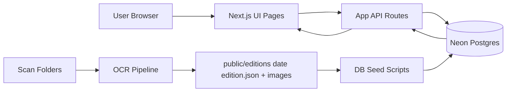

# Project Master Guide

## 1. Executive Overview
The Transcript Archive is a web product that turns scanned historical issues of OWU's student newspaper into a searchable, readable, and context-rich experience. Users can enter by date, read stories by section, open scan images, search by keyword and filters, and ask natural-language questions over archived content. Behind the scenes, a Python OCR pipeline extracts and enriches edition content, Node scripts clean and seed data, and a Next.js app serves it through API and UI layers.

What users can do:
- Browse editions by date.
- Read categorized stories (Campus News, News, Sports, Opinion, Arts & Entertainment).
- View scanned page/region images.
- Search archive content with filters.
- Ask the archive questions using retrieval + generation (RAG).
- View date-linked weather and music context.

What makes this system unique:
- It combines static archival material, OCR enrichment, and live query APIs in one stack.
- It supports both deterministic search and semantic Q&A over the same corpus.
- It preserves both text-first reading and scan-image provenance.

> **What this means for users**: The archive is not just scanned PDFs; it behaves like a modern, filterable, explainable content system.
>
> **What this means for operations**: Content quality depends on a repeatable OCR + cleanup + seed workflow, not just frontend code.

Primary source files:
- `/Users/bamyani/Desktop/interactive-newspaper-main/src/app/page.tsx`
- `/Users/bamyani/Desktop/interactive-newspaper-main/src/app/edition/[date]/page.tsx`
- `/Users/bamyani/Desktop/interactive-newspaper-main/ocr/convert_scans.py`
- `/Users/bamyani/Desktop/interactive-newspaper-main/scripts/ocr/process-edition.sh`

---

## 2. Product Surface Map

### Pages and purpose
- `/`: Landing and edition entry experience.
- `/edition/[date]`: Main reading surface for a specific edition.
- `/search`: Full-text archive search UI.
- `/ask`: Ask-the-archive Q&A UI.
- `/about`: Product/context page.
- `/contact`: Contact page.

### API surfaces (key)
- `GET /api/editions`: List editions with pagination/filtering.
- `GET /api/editions/[date]`: Return one edition's articles and ads.
- `GET /api/editions/[date]/images/[...path]`: Return image bytes for edition images.
- `GET /api/search`: Search articles by query + filters.
- `POST /api/ask`: RAG answer endpoint with citations.
- `GET /api/weather`: Date-based weather lookup.

Source files:
- `/Users/bamyani/Desktop/interactive-newspaper-main/src/app/page.tsx`
- `/Users/bamyani/Desktop/interactive-newspaper-main/src/app/edition/[date]/page.tsx`
- `/Users/bamyani/Desktop/interactive-newspaper-main/src/app/search/page.tsx`
- `/Users/bamyani/Desktop/interactive-newspaper-main/src/app/ask/page.tsx`
- `/Users/bamyani/Desktop/interactive-newspaper-main/src/app/api/editions/route.ts`
- `/Users/bamyani/Desktop/interactive-newspaper-main/src/app/api/editions/[date]/route.ts`
- `/Users/bamyani/Desktop/interactive-newspaper-main/src/app/api/editions/[date]/images/[...path]/route.ts`
- `/Users/bamyani/Desktop/interactive-newspaper-main/src/app/api/search/route.ts`
- `/Users/bamyani/Desktop/interactive-newspaper-main/src/app/api/ask/route.ts`
- `/Users/bamyani/Desktop/interactive-newspaper-main/src/app/api/weather/route.ts`

---

## 3. User Flows

## 3.1 First-time visitor flow (Landing -> Edition)
Trigger:
- User opens `/`.

User goal:
- Enter the archive at a valid edition date.

UI surfaces touched:
- Landing page (`PageShell`, `EditionPicker`, Enter button).

APIs called:
- `GET /api/editions` (via archive context provider).

Data returned:
- List of editions with date + counts used to populate picker.

Flow (steps):
1. Landing page loads and fetches edition list.
2. Default edition is selected (latest available date).
3. User clicks Enter.
4. App transitions to `/edition/[date]`.

Result:
- User lands in the date-specific reading experience.

What if something fails:
- If editions fail to load, the picker cannot populate and entering is blocked.
- If requested date is invalid, edition page redirects to latest known valid date.

Source files:
- `/Users/bamyani/Desktop/interactive-newspaper-main/src/app/page.tsx`
- `/Users/bamyani/Desktop/interactive-newspaper-main/src/features/archive/context/ArchiveContext.tsx`
- `/Users/bamyani/Desktop/interactive-newspaper-main/src/app/edition/[date]/page.tsx`

## 3.2 Edition reading flow (Navigation, article expansion, scan viewer)
Trigger:
- User is on `/edition/[date]`.

User goal:
- Read stories by section and inspect source imagery.

UI surfaces touched:
- Navigation sidebar/mobile nav.
- News feed (hero/featured/section variants).
- Scan viewer modal.

APIs called:
- `GET /api/editions/[date]` for article/ad payload.
- `GET /api/editions/[date]/images/[...path]` when image URLs render.

Data returned:
- Edition metadata, ordered articles, ads, pagination object.
- Image bytes with type headers.

Flow (steps):
1. Edition page reads date from URL.
2. Hook loads edition data from API.
3. User changes sections (Top, category sections, Ads/Classifieds).
4. User expands article cards and can open scanned page/image views.

Result:
- User consumes normalized article data with linked scan imagery.

What if something fails:
- API errors show loading/error states.
- Missing images return 404; text content still works.

Source files:
- `/Users/bamyani/Desktop/interactive-newspaper-main/src/app/edition/[date]/page.tsx`
- `/Users/bamyani/Desktop/interactive-newspaper-main/src/features/news-feed/hooks/useEditionArticles.ts`
- `/Users/bamyani/Desktop/interactive-newspaper-main/src/features/news-feed/components/NewsFeed.tsx`
- `/Users/bamyani/Desktop/interactive-newspaper-main/src/app/api/editions/[date]/route.ts`
- `/Users/bamyani/Desktop/interactive-newspaper-main/src/app/api/editions/[date]/images/[...path]/route.ts`

## 3.3 Date switching flow (time controls + archive context)
Trigger:
- User changes date using edition controls/navigation.

User goal:
- Move between historical editions quickly.

UI surfaces touched:
- Time controls and edition routing.

APIs called:
- `GET /api/editions` for available dates.
- `GET /api/editions/[date]` for selected edition.

Data returned:
- Edition list and selected edition content.

Flow (steps):
1. User selects a new date.
2. Router moves to `/edition/[new-date]`.
3. Edition data hook fetches new payload.
4. Feed animates and refreshes section data.

Result:
- User sees new edition in same reading interface.

What if something fails:
- Invalid date path redirects to latest valid edition.
- Network/API failure shows error state while preserving shell.

Source files:
- `/Users/bamyani/Desktop/interactive-newspaper-main/src/app/edition/[date]/page.tsx`
- `/Users/bamyani/Desktop/interactive-newspaper-main/src/features/archive/context/ArchiveContext.tsx`

## 3.4 Search flow (query + filters + pagination)
Trigger:
- User opens `/search` and types a query.

User goal:
- Find relevant archived stories by text and constraints.

UI surfaces touched:
- Search bar, filters, results cards, load-more control.

APIs called:
- `GET /api/search?q=...&category=...&start_date=...&end_date=...&limit=...&offset=...`

Data returned:
- Search results with ranking/snippets and pagination metadata.

Flow (steps):
1. User enters query (debounced).
2. Hook sends search API request with filters.
3. Results list renders ranked entries.
4. User loads more pages via offset pagination.

Result:
- User discovers stories across dates/categories with snippet highlights.

What if something fails:
- Missing `q` returns 400.
- Search backend issues return 500 and UI error state.

Source files:
- `/Users/bamyani/Desktop/interactive-newspaper-main/src/features/search/hooks/useSearch.ts`
- `/Users/bamyani/Desktop/interactive-newspaper-main/src/app/api/search/route.ts`
- `/Users/bamyani/Desktop/interactive-newspaper-main/src/lib/db.ts`

## 3.5 Ask Archive flow (question -> retrieval -> answer + citations)
Trigger:
- User opens `/ask` and submits a question.

User goal:
- Get a synthesized answer grounded in archive sources.

UI surfaces touched:
- Ask input, answer panel, source/citation list.

APIs called:
- `POST /api/ask`.

Data returned:
- Answer text.
- Confidence label.
- Citation list.
- Source article summaries/snippets.
- Timing + method metadata.

Flow (steps):
1. User submits question.
2. API reformulates query.
3. API embeds reformulated text.
4. API performs hybrid retrieval (vector + FTS) with timeout/fallback.
5. API reranks candidates.
6. API generates final answer with citations.

Result:
- User gets an explainable answer tied to archive sources.

What if something fails:
- Validation errors return 400.
- Retrieval timeout returns 504.
- Embedding/LLM failures return 502/500 style errors.

Source files:
- `/Users/bamyani/Desktop/interactive-newspaper-main/src/features/ask-archive/hooks/useAskArchive.ts`
- `/Users/bamyani/Desktop/interactive-newspaper-main/src/app/api/ask/route.ts`
- `/Users/bamyani/Desktop/interactive-newspaper-main/src/lib/embeddings.ts`
- `/Users/bamyani/Desktop/interactive-newspaper-main/src/lib/db.ts`
- `/Users/bamyani/Desktop/interactive-newspaper-main/src/lib/answer-generator.ts`

## 3.6 Context flow (weather + music tied to selected date)
Trigger:
- User is reading an edition with a selected date.

User goal:
- Understand historical context around that issue date.

UI surfaces touched:
- Right context sidebar (weather widget + music player).

APIs called:
- `GET /api/weather?date=...&scope=...`.
- (Music data is loaded from local archive/index paths via music feature/services.)

Data returned:
- Weather record (local archive first, provider fallback).
- Date-aligned monthly music tracks.

Flow (steps):
1. Date changes on edition page.
2. Context sidebar hooks refresh weather/music for that date.
3. Sidebar updates cards/player state.

Result:
- User sees environmental and cultural context alongside articles.

What if something fails:
- Weather can return 400/404 style errors; sidebar shows unavailable state.
- Music gaps fall back to graceful empty states.

Source files:
- `/Users/bamyani/Desktop/interactive-newspaper-main/src/features/context-panel/components/ContextSidebar.tsx`
- `/Users/bamyani/Desktop/interactive-newspaper-main/src/app/api/weather/route.ts`
- `/Users/bamyani/Desktop/interactive-newspaper-main/src/lib/weather-local-archive.ts`
- `/Users/bamyani/Desktop/interactive-newspaper-main/src/features/music-player/hooks/useMonthlyTrendingMusic.ts`

> **What this means for users**: Every core flow is date-centric and consistent across browse/read/search/ask.
>
> **What this means for operations**: Date integrity and seeded completeness are critical to avoid broken cross-feature experiences.

---

## 4. Architecture Overview

The system has five cooperating blocks:
1. Frontend app (Next.js App Router + feature modules).
2. API layer (server routes under `src/app/api/*`).
3. Data layer (Neon Postgres for editions/articles/ads/weather/music + FTS/vector retrieval).
4. OCR ingestion pipeline (Python package + wrappers + diagnostics artifacts).
5. Batch/ops scripts (shell + Node scripts for process/cleanup/seed/embed).

Source files:
- `/Users/bamyani/Desktop/interactive-newspaper-main/src/app/layout.tsx`
- `/Users/bamyani/Desktop/interactive-newspaper-main/src/app/api/editions/route.ts`
- `/Users/bamyani/Desktop/interactive-newspaper-main/src/lib/db.ts`
- `/Users/bamyani/Desktop/interactive-newspaper-main/ocr/src/transcript_ocr/README.md`
- `/Users/bamyani/Desktop/interactive-newspaper-main/scripts/ocr/process-edition.sh`
- `/Users/bamyani/Desktop/interactive-newspaper-main/scripts/db/seed.mjs`

> **What this means for users**: UI behavior depends on both realtime API and periodically processed OCR data.
>
> **What this means for operations**: Pipeline reliability and DB freshness directly control product quality.

---

## 5. Data Lifecycle (End-to-End)

1. Raw scans arrive in `ocr/inbox/<edition-folder>/`.
2. `scripts/ocr/process-edition.sh` runs OCR (`ocr/convert_scans.py`) and writes `public/editions/<date>/edition.json` plus image assets.
3. Post-OCR mutation scripts run:
- `ocr/enrich_ads.py` enriches ads.
- `scripts/cleanup-images.mjs` removes/reassigns low-relevance image attachments.
4. `scripts/db/seed.mjs` transforms edition JSON via OCR adapter and upserts into PostgreSQL tables.
5. App APIs query DB and return normalized payloads to UI.

Artifact outputs:
- App-serving: `public/editions/<date>/edition.json`, `public/editions/<date>/images/*`.
- OCR diagnostics/intermediates: `ocr/runs/<date>/...` including diagnostics and issue reports.

Source files:
- `/Users/bamyani/Desktop/interactive-newspaper-main/scripts/ocr/process-edition.sh`
- `/Users/bamyani/Desktop/interactive-newspaper-main/scripts/ocr/process-unprocessed.sh`
- `/Users/bamyani/Desktop/interactive-newspaper-main/ocr/convert_scans.py`
- `/Users/bamyani/Desktop/interactive-newspaper-main/ocr/enrich_ads.py`
- `/Users/bamyani/Desktop/interactive-newspaper-main/scripts/cleanup-images.mjs`
- `/Users/bamyani/Desktop/interactive-newspaper-main/scripts/db/seed.mjs`

---

## 6. OCR Pipeline (Stakeholder Version)

High-level stages:
1. Ingest scans from edition folder.
2. Detect visual regions (photo/figure candidates).
3. Extract structured content using LLM.
4. Merge continuation stories across pages.
5. Attach and sanitize image assignments.
6. Write edition artifacts (`edition.json`, markdown summaries).
7. Enrich ads with category/type/display metadata.
8. Seed transformed content into DB.

Key outputs and diagnostics:
- `edition.json`
- `diagnostics.json`
- `issue_report.json`
- `issue_report.md`
- `run_manifest.json`

Source files:
- `/Users/bamyani/Desktop/interactive-newspaper-main/ocr/src/transcript_ocr/application/page_pipeline.py`
- `/Users/bamyani/Desktop/interactive-newspaper-main/ocr/src/transcript_ocr/application/edition_pipeline.py`
- `/Users/bamyani/Desktop/interactive-newspaper-main/ocr/src/transcript_ocr/merging/llm_merge.py`
- `/Users/bamyani/Desktop/interactive-newspaper-main/ocr/src/transcript_ocr/diagnostics/run_manifest.py`
- `/Users/bamyani/Desktop/interactive-newspaper-main/ocr/src/transcript_ocr/diagnostics/issue_report.py`
- `/Users/bamyani/Desktop/interactive-newspaper-main/docs/ocr-audit/full-e2e-ocr-pipeline-deep-dive.md`

> **What this means for users**: Story readability and media placement quality come from multiple validation/sanitation passes.
>
> **What this means for operations**: Diagnostics artifacts are required for debugging regressions and validating runs.

---

## 7. API Catalog

## 7.1 `GET /api/editions`
Purpose:
- List editions with optional date range + pagination.

Input:
- Query: `limit`, `offset`, `start_date`, `end_date`.

Response shape summary:
- `editions[]` + `pagination { total, limit, offset, hasMore }`.

Typical UI consumer:
- Landing + archive context provider.

Error behavior:
- `500` on backend/query failure.

Source:
- `/Users/bamyani/Desktop/interactive-newspaper-main/src/app/api/editions/route.ts`

## 7.2 `GET /api/editions/[date]`
Purpose:
- Return one edition's article/ad payload.

Input:
- Path param: `date` (ISO `YYYY-MM-DD`).

Response shape summary:
- `edition`, `articles`, `ads`, `otherContent`, `pagination`.

Typical UI consumer:
- Edition page data hook.

Error behavior:
- `400` invalid date format.
- `404` edition not found.
- `500` load/query failure.

Source:
- `/Users/bamyani/Desktop/interactive-newspaper-main/src/app/api/editions/[date]/route.ts`

## 7.3 `GET /api/editions/[date]/images/[...path]`
Purpose:
- Stream image files for edition assets.

Input:
- Path params: `date`, nested image path.

Response shape summary:
- Raw image bytes with `Content-Type` and cache headers.

Typical UI consumer:
- Article cards/viewers displaying OCR-linked images.

Error behavior:
- `400` invalid date or unsupported extension.
- `403` forbidden/path traversal.
- `404` missing image.

Source:
- `/Users/bamyani/Desktop/interactive-newspaper-main/src/app/api/editions/[date]/images/[...path]/route.ts`

## 7.4 `GET /api/search`
Purpose:
- Full-text search over seeded articles.

Input:
- Required `q`.
- Optional `category`, `start_date`, `end_date`, `limit`, `offset`.

Response shape summary:
- `query`, `results[]`, `pagination`.

Typical UI consumer:
- Search page hook/components.

Error behavior:
- `400` if `q` missing.
- `500` search failure.

Source:
- `/Users/bamyani/Desktop/interactive-newspaper-main/src/app/api/search/route.ts`

## 7.5 `POST /api/ask`
Purpose:
- Retrieval-augmented answer generation with citations.

Input:
- JSON body: `question`, optional filters.

Response shape summary:
- `answer`, `citations`, `confidence`, `sourceArticles`, `meta`.

Typical UI consumer:
- Ask Archive panel/page.

Error behavior:
- `400` invalid/missing question.
- `502` embedding failure path.
- `504` retrieval timeout.
- `500` unhandled error.

Source:
- `/Users/bamyani/Desktop/interactive-newspaper-main/src/app/api/ask/route.ts`

## 7.6 `GET /api/weather`
Purpose:
- Date-based weather lookup with local-first strategy.

Input:
- Required `date`.
- Optional `scope` and location/provider params.

Response shape summary:
- `query`, `record`, `reason`, `attempts`.

Typical UI consumer:
- Context sidebar weather widget.

Error behavior:
- `400` missing/invalid date.
- `404` no record found.

Source:
- `/Users/bamyani/Desktop/interactive-newspaper-main/src/app/api/weather/route.ts`

---

## 8. Data & Schema Summary

## 8.1 Key DB tables
- `editions`: date-level metadata.
- `articles`: normalized OCR articles + search/vector fields.
- `ads`: enriched advertisement records.
- `weather`: date/scope weather records.
- `music`: monthly rank/track data.

Source:
- `/Users/bamyani/Desktop/interactive-newspaper-main/scripts/db/schema.sql`

## 8.2 OCR-to-DB mapping (stakeholder-level)

| OCR output field | Transformation layer | DB destination |
|---|---|---|
| `edition_date`, `publication_info` | Seed script + adapter | `editions.date`, `editions.publication_info` |
| `articles[].headline/body/category` | `transformArticles` | `articles.headline`, `articles.full_text/body_plain`, `articles.category` |
| `articles[].author/writer_position` | `transformArticles` cleanup | `articles.byline`, `articles.writer_position` |
| `articles[].source_pages` | page derivation | `articles.page` |
| `articles[].image_files/images.caption` | adapter image rules | `articles.image_urls`, `articles.image_caption`, `articles.image_captions` |
| `ads[]` + `enriched_ads[]` | `transformAds` | `ads.*` columns |

Source files:
- `/Users/bamyani/Desktop/interactive-newspaper-main/src/server/ocr-adapter/index.ts`
- `/Users/bamyani/Desktop/interactive-newspaper-main/src/server/ocr-adapter/article-transform.ts`
- `/Users/bamyani/Desktop/interactive-newspaper-main/src/server/ocr-adapter/ad-transform.ts`
- `/Users/bamyani/Desktop/interactive-newspaper-main/scripts/db/seed.mjs`

## 8.3 Where metadata appears in product
- Category drives section grouping in the edition reader.
- Byline/writer position appears in article rendering and search results.
- Image URLs/captions drive article cards and scan viewer attachments.

Source files:
- `/Users/bamyani/Desktop/interactive-newspaper-main/src/features/news-feed/components/NewsFeed.tsx`
- `/Users/bamyani/Desktop/interactive-newspaper-main/src/features/news-feed/hooks/useEditionArticles.ts`
- `/Users/bamyani/Desktop/interactive-newspaper-main/src/types/index.ts`

---

## 9. Operational Runbook (Non-engineer Friendly)

## 9.1 Checklist: How one edition gets into the app
1. Place scan folder in `ocr/inbox/`.
2. Run `scripts/process-edition.sh <edition-folder>`.
3. Confirm `public/editions/<date>/edition.json` exists.
4. Confirm logs/artifacts in `ocr/runs/<date>/` (or run-id path).
5. Run DB seed for the date.
6. Open `/edition/<date>` and validate content.

## 9.2 Checklist: How all unprocessed editions are run
1. Ensure unprocessed folders are in `ocr/inbox/`.
2. Run `scripts/process-unprocessed.sh` (or `--parallel N`).
3. Review batch summary (success/fail counts).
4. Inspect per-edition logs and rerun failed dates.

## 9.3 Where logs and reports are found
- OCR stage logs: `ocr/runs/<date>/`.
- Run snapshots/diagnostics: `ocr/runs/<date>/runs/<run-id>/` when run IDs are used.
- Issue reports: `issue_report.json` + `issue_report.md` in run root.
- Seed summaries: path passed via `--summary-path` in seed stage.

## 9.4 Common failure points and who investigates
- OCR extraction quality/failures: OCR engineering owner.
- API/DB query failures: backend/data owner.
- UI rendering mismatch: frontend owner.
- Environment/auth variables (`GOOGLE_API_KEY`, `DATABASE_URL`): platform/devops owner.

## 9.5 Ownership map (by functional area)
- Frontend UX: `src/app/*`, `src/features/*`.
- API endpoints: `src/app/api/*`.
- DB/query + RAG logic: `src/lib/db.ts`, retrieval/embedding modules.
- OCR runtime: `ocr/src/transcript_ocr/*`, wrappers under `ocr/*.py`.
- Batch orchestration and data mutation scripts: `scripts/ocr/*`, `scripts/db/*`, `scripts/cleanup-images.mjs`.

Source files:
- `/Users/bamyani/Desktop/interactive-newspaper-main/scripts/ocr/process-edition.sh`
- `/Users/bamyani/Desktop/interactive-newspaper-main/scripts/ocr/process-unprocessed.sh`
- `/Users/bamyani/Desktop/interactive-newspaper-main/scripts/db/seed.mjs`
- `/Users/bamyani/Desktop/interactive-newspaper-main/ocr/src/transcript_ocr/README.md`

> **What this means for users**: Stable operations directly improve discoverability and answer quality.
>
> **What this means for operations**: Treat OCR + seed as production data ingestion, with artifacts as mandatory evidence.

---

## 10. Risks, Constraints, and Current Gaps

External dependency risks:
- LLM provider latency/availability affects OCR extraction and Ask Archive generation.
- Database/network availability affects all API-backed flows.

Data-quality risks:
- OCR ambiguity for damaged scans.
- Image-caption/article alignment can drift without cleanup checks.
- Category normalization can vary if upstream OCR output quality changes.

Runtime/cost considerations:
- OCR/LLM stages scale with page count and concurrency.
- Parallel batch runs increase throughput but also aggregate token/API usage.
- Seed and embedding operations scale with article volume.

Known drift areas + guardrails:
- Legacy compatibility wrappers and fallback paths can diverge if untested.
- Guardrail tests are in place:
  - Architecture import boundaries.
  - Wrapper/runtime cutover checks.
  - OCR invariants and golden tests.
  - Parity harness and artifact contract tests.

Source files:
- `/Users/bamyani/Desktop/interactive-newspaper-main/tests/ocr/architecture/test_import_rules.py`
- `/Users/bamyani/Desktop/interactive-newspaper-main/tests/ocr/architecture/test_wrapper_entrypoints.py`
- `/Users/bamyani/Desktop/interactive-newspaper-main/tests/ocr/architecture/test_runtime_cutover.py`
- `/Users/bamyani/Desktop/interactive-newspaper-main/tests/ocr/pipeline-invariants.test.ts`
- `/Users/bamyani/Desktop/interactive-newspaper-main/tests/ocr/pipeline-golden.test.ts`
- `/Users/bamyani/Desktop/interactive-newspaper-main/tests/ocr/test_parity_harness.py`

---

## 11. Glossary
- **Edition**: One dated newspaper issue and its derived data package.
- **OCR**: Optical character recognition and structure extraction from scans.
- **Merge pass**: Cross-page logic to join continuation fragments into complete articles.
- **RAG**: Retrieval-Augmented Generation; answer generation grounded in retrieved archive articles.
- **Vector search**: Similarity-based retrieval using numeric embeddings.
- **Hero/Featured**: Presentation flags identifying top-priority stories in UI.
- **Classified vs Display ads**: Two ad presentation types (short text listings vs full display ads).
- **Run manifest**: Provenance artifact listing run inputs, hashes, and metadata.
- **Issue report**: Generated diagnostics report summarizing detected run issues.

---

## 12. How to Read This Project in 10 Minutes
1. Open the app landing page (`/`) and enter the latest edition.
2. On `/edition/[date]`, switch sections and open a scan-linked story image.
3. Go to `/search`, run a keyword query, and apply one category/date filter.
4. Go to `/ask`, submit a question, and inspect citations/source cards.
5. Return to edition page and note weather/music context tied to the same date.
6. Read the data path summary in this guide (Sections 5 and 6) to connect UI output to ingestion pipeline.
7. If you need implementation depth, open the OCR deep dive:
- `/Users/bamyani/Desktop/interactive-newspaper-main/docs/ocr-audit/full-e2e-ocr-pipeline-deep-dive.md`

---

## Validation checklist for this guide
- Every major page and API endpoint is covered.
- All six required user flows are documented with trigger, steps, result, and failure mode.
- End-to-end scan -> OCR -> cleanup -> seed -> API -> UI lifecycle is explicitly mapped.
- Claims are grounded in current repository source files.
- Terminology is normalized via glossary.
