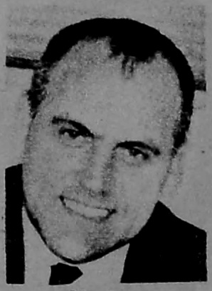
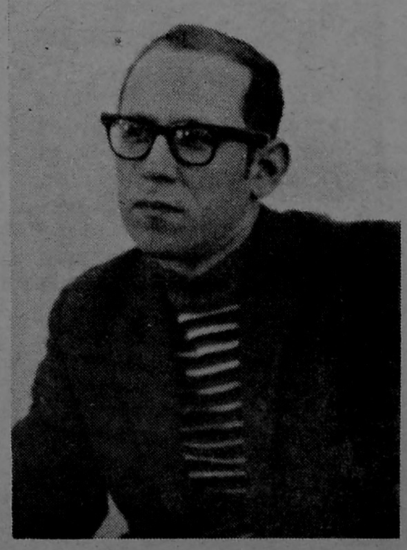

# 0001_Page 1

*Ohio Wesleyan Transcript. AN INDEPENDENT STUDENT NEWSPAPER. Vol. 103, No. 1. Ohio Wesleyan University, Delaware, Ohio 43015. Price—25 Cents. January 7, 1970*

Page 1

---

## Questionable Legal Proceedings 'Convict' 22 Students

*By Peter Brown Student Government Editor*

In a court of law, the prosecution doesn't sit on the jury.

Yet that was in effect what happened in a case involving the "conviction" of 22 OWU students in December. The students were charged by the administration with violation of residence hall visitation policy, and brought before the University's joint judiciary, a combination of Men's Court and AWS Judicial.

Included among the voting members of the judiciary were James Miller, assistant dean of men, and Mary Roach, assistant dean of women.

Both Miller and Miss Roach are part of the student affairs staff which formulated the charges against students.

This unusual courtroom procedure grew out of the fact that OWU's student courts have no written procedures, underscoring the sad fact that the University's judicial procedure is completely inadequate.

As University President Thomas Wenzlau said last fall, "Any new judicial system would be better than the one we have now."

All of the 22 students convicted on Dec. 4 pleaded guilty, according to Sue Cunning, head of AWS judicial. But several have told the Transcript they may appeal the decisions based upon the unusual procedure of the court.

The hearing was on charges that the 12 women and ten men were guilty of dorm and fraternity house visitation violations on the weekend of Nov. 22.

R. Philip Shober, vice president for student affairs, said the charges did not stem from a "raid," although he, Calvin Potter, director of security and safety, and another University policemen combined to detect the violations.

Shober said he was "nosing around on my own" at 2 a.m. Nov. 22 to determine whether students observe University rules.

Gary Smeal, chief justice of Men's Court, said about 14 of the students were involved in violations at the Sigma Alpha Epsilon house. All but one of these, Smeal said, were given good conduct probation for two terms and were denied visitation privileges until Jan. 15.

Violators at the Sigma Chi house, East Selby, and Welch and Thomson Halls were given lesser sentences, Smeal said.

---

## Shober Resigns VP Post To Resume Teaching Duties

R. Philip Shober, vice president for student affairs, has resigned his administrative post.

The resignation is effective at the end of this academic year.

Shober will remain at OWU as a full-time member of the education department. He will also continue his duties as director of Upward Bound.

Shober accepted the vice presidency in 1968 after Trustee action created the position on an experimental basis. He was previously assistant professor of education.

In submitting his resignation Shober said he wishes to be relieved of administrative responsibility but will remain in his position through this year to permit a replacement to be found.

OWU President Thomas E. Wenzlau said, "We regret that Dr. Shober has made the decision to leave the vice presidency, but we are especially happy that he will continue to serve Ohio Wesleyan in a teaching capacity."

Wenzlau said one person on campus has been interviewed as a replacement. He said others will be interviewed and a replacement will hopefully be named this term.

Wenzlau said the choice of a replacement is a presidential decision.

The future responsibilities of the vice presidential office are yet to be defined, Wenzlau said. The duties of the new vice president may be broadened, he added.

> Photo: Shober

> Photo: Portrait of R. Philip Shober, who resigned as Vice President to resume teaching duties.

---

## A SNOWBOUND CAMPUS

> Photo: A SNOWBOUND CAMPUS awaited returning students this past week. The calm and quiet of this scene on the sidewalk between Gray Chapel and Slocum Hall was sharply contrasted by long lines and extensive waiting time inside Gray Chapel that accompanied this term's new registration procedures. Transcript Photo (Barb Goode)

> Photo: A snow-covered scene on the Ohio Wesleyan University campus.

---

## Group Tackles Jurisdictional Web

The confusing web of overlapping jurisdiction in student organizations may soon be made clearer.

Paul Dahlquist, chairman of the Wesleyan Council on Student Affairs and instructor in sociology, was to have appointed a committee Monday to determine the relationship of WCSA to the Interfraternity Council, Panhellenic Council, Student Government and the Association of Women Students (AWS).

Dahlquist said the committee will consist of one representative of each of those four organizations, two WCSA members, James Studer, dean of men, and Mary Roach, assistant dean of women.

According to its charter, WCSA "shall formulate basic policies on all matters related to student life outside the classroom."

During fall term, which was WCSA's first, representatives of AWS objected to WCSA's liberalized visitation policy on the grounds that it was in conflict with AWS's women's hours policy. The administration is currently reviewing the policy, which would give living units complete autonomy to determine their own visitation hours.

Senior Darwin Wales, WCSA vice chairman, told the representatives that WCSA has primary jurisdiction on all student matters. A WCSA member, Edward Robinson, professor of speech, said at a December meeting that all student groups are to be subordinate to WCSA.

Dahlquist said the other organizations "don't agree with that thinking."

In other action, WCSA members considered ways of further publicizing WCSA legislation.

This was in response to senior Janet Young who presented Dahlquist with a petition for a student review of the visitation policy.

Miss Young said she had not tried to obtain the signatures of 25 per cent of the student body which would be necessary to begin a student review.

Miss Young told WCSA that OWU's students weren't aware of the provisions of the policy. "The majority of the kids weren't opposed to the policy itself," Miss Young said, "They just wanted a more thorough review of what's going on."

Dahlquist said that The Transcript had published the major provisions of the policy, and that all dorm counselors and senior advisors had been given copies of the policy. "Other than that," he said, "I don't know what we can do to publicize it."

---

## Senior Coeds Organize T'script Press Council

A Transcript press council is being set up for this term and spring term by senior journalism majors Barb Goode and Jean Gulliver as a seminar project.

The press council, according to its founders, who are also Transcript editors, will serve as a twofold purpose. The group, to be made up of four underclass students, three faculty members and two administrators, will function as a sounding board for Transcript coverage.

It will also serve to educate the University community about the problems and journalistic views of The Transcript editors and reporters. Miss Gulliver said the group will not have any direct, pre-publication control over Transcript news or editorial content.

Press council meetings will be held over dinner approximately every other Wednesday. Interested persons may contact the press council with complaints, suggestions or applications for membership at The Transcript office.

---

## Malcolm Baroway Named OWU Public Relations Head

Malcolm S. Baroway was named OWU director of public relations by President Thomas E. Wenzlau Monday.

Baroway, whose appointment took effect immediately, will be responsible for the overall public relations of the University under the direction of Robert M. Barr, who was appointed director of University relations last fall.

Holding a B.A. and M.A. from The Johns Hopkins University, Baroway has served as directory of public relations and publications at Jacksonville (Fla.) University, assistant director of public relations at Johns Hopkins, and acting publications director for Boston University.

He has also taught creative writing, English literature and speech at the college level.

In announcing the appointment Wenzlau said, "In time of such rapid change in higher education, communication with the off-campus public, in the local community and with alumni is increasingly important and increasingly difficult. We are happy to find a man with Mr. Baroway's qualifications and experience to head this program at Ohio Wesleyan."

> Photo: Malcolm Baroway

> Photo: Portrait of Malcolm Baroway, newly named OWU Public Relations Head.

---

## Chapel-Forum

Friday, Forum, 10 a.m., Gray, "An Overview of the Press and its Problems," Verne E. Edwards, professor of journalism and author of "Journalism in a Free Society."

Wednesday, Chapel, 11 a.m., 4:10 p.m. Friday. Forum enrollees and others interested in the response to Vice-President Agnew's criticisms of the mass media are urged to attend by Verne Edwards, professor of journalism, who is coordinating the Forum.

Special showings of the Nov. 25 CBS "60 Minutes" program on the press will be made in the Phillips Auditorium at 11 a.m. and 4:10 p.m. Friday.
