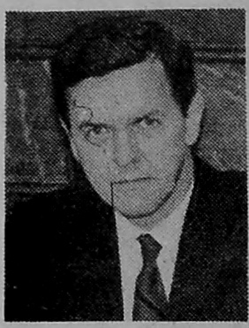
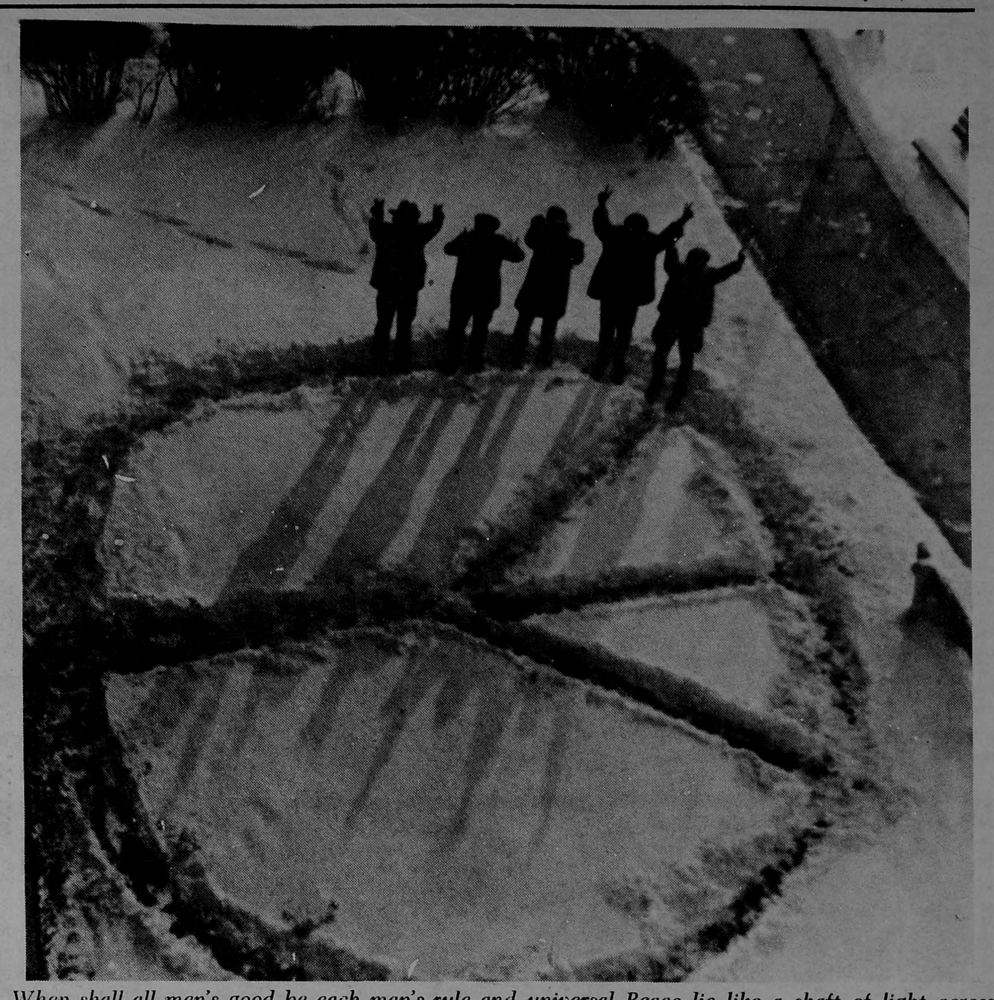

# 0004_Page 4

*Ohio Wesleyan Transcript Founded 1867. Published weekly September through May except during University holidays and examination periods. Entered as second class mail under Act of Mar. 8, 1897, postage paid at U.S. Post Office, Delaware, Ohio 43015. Subscription rates: $5.50 per year (mail $6.00). National Advertising representatives: National Educational Advertising Service, Inc., 360 Lexington Ave., New York, N.Y. 10017. Member Association, Editorial and Business address: Ohio Wesleyan University, Delaware, Ohio 43015.*

Page 1

---

## Transcript Editorial: A Question Of Supremacy

When proposed by the Student Life Commission two years ago, the Wesleyan Council on Student Affairs seemed to be the answer to everyone's hopes and dreams—both for efficiency and for efficacy of University government.

This ideal situation is fast taking on the appearances of a pipedream—not particularly because WCSA itself is failing to function, but because of the stumbling blocks being thrown into its path at every turn.

Various campus organizations have failed to step out of their own self-confident shells to look at the broad picture and the way their group can best fit into it. Organizations do not exist merely to perpetuate themselves without purpose—at least, they should not exist this way in a community environment.

Actions such as that of AWS, which asserts that it is attempting to help WCSA while continuing to subvert this body as the group responsible for all phases of student life outside the classroom, cannot be tolerated. Sour grapes, wounded pride and attempts to save a sinking ship for its own rotting wood do not and cannot contribute to the good of the entire community.

Student Government, Panhel, IFC, AWS—actually all campus groups must, even if belatedly, reexamine their own purposes and the ways in which they can best aid WCSA. Instead, last term many of these groups seemed to ignore the value of WCSA in favor of their own narrow-minded views of life.

If the faith which once was so vitally inherent in the plan for WCSA is allowed to die completely at this time, it will probably never be revived. WCSA will suffer lamely along until someone dissolves it for another, less potentially workable system. Students in the past two and future few years will have had a hand in conceiving and destroying their own dreams of a true University community.

Unless the student body and heads of student organizations wake up now—WCSA and community confidence in student responsibility in the area of government seem doomed.

> Photo: When shall all men's good be each man's rule and universal Peace lie like a shaft of light across the land . . . like a lane of beams across the sea? — Tennyson

---

## Forum Preview

*By Verne E. Edwards, Jr. Professor of Journalism*

In our examination of this nation's "fourth branch of government," we are not asking citizens to view the press on any love-it-or-leave-it basis. It is impossible to love all parts of either the print or electronic press; it is difficult to "leave" the press in the sense that its total performance must affect all citizens, at least indirectly.

My "Overview of the Press and Its Problems" Friday will be delivered from a position of nearly fundamentalist belief in press freedom, but faults of our free press will get more than equal time. Without texts of their addresses before me, I will still wager that criticisms will outweigh defenses in the next seven addresses—far more heavily than "pro-liberal" coverage outweighs "pro-conservative" coverage in the Eastern press, Vice-President Agnew to the contrary notwithstanding. In fact, our special showings of the Nov. 25 CBS "60 Minutes" program on Friday are gestures toward "equal time" for press defenders.

Having worked in various roles on newspapers ranging from poor to superior, I have had good inside looks at the perils and promises of an unregulated press. Having studied those perils and promises from the ivory tower for two decades, I am dedicated to curbing the perils and promoting the promises.

In my opinion, curbing the perils by curbing freedom would ultimately destroy this free society.

> Photo: Edwards

> Photo: A portrait of Verne E. Edwards, Jr., who authored the Forum Preview column.

---

## Weidenbusch Offers AFROTC Information

Editor, The Transcript:

I wish to express my thanks to the many students, alumni, faculty members, and other readers of The Transcript, who offered encouragement and support to me and the Air Force ROTC program here, during the past several years when our position appeared to be tenuous, and who have been profuse with their congratulations now that this issue is settled.

As a result of the in extremis exertions of our campus opponents, however, there remain certain misconceptions about the aims, opportunities, and conditions of the Ohio Wesleyan Air Force program. I have addressed these in recent talks and correspondence, but, for those who seek further information, I repeat my offer to provide complete information at any time.

Albert C. Weidenbusch, Col., USAF

Professor of Aerospace Studies

---

## Segovia Participants 'Doing Just Fine'

Editor, The Transcript:

This letter is to let everyone at Wesleyan know that the new branch school set up this year in Segovia, Spain is doing just fine. Everyone here is taking full advantage of this wonderful opportunity to learn a foreign language and live in a warm friendly country.

The program, as organized by Professor Hugh Harter, encourages all of us to learn in school as well as out in the city. Our classes are varied and keep us studying a good deal of the time. As far as our professors go, the only word to describe them is excellent.

Every man is an expert in his subject matter and can present an idea in such a way that everyone from the most advanced student to the beginner can understand and remain interested.

Our life outside of the classroom an apartment for us so we always have a place to study or have parties. The "piso" has a large living room, a study, a cave in the basement and a kitchen.

Professor Harter spent Thanksgiving week with us to check up on the progress of the program. We all think he left here very pleased. Any trivial problems that we had the first month have been ironed out. The big event of the week was our Thanksgiving dinner. Spaniards, obviously, don't celebrate Thanksgiving, but we Americans certainly do no matter where we are.

Everyone here in Segovia wants to say "hi" to all their friends at OWU.

Gladys Hall

Peggy Johnston

Karen Laidlaw

Sue Lawther

Marcia Riis

Stu Rubin

Vicki Schalip

Rick West

Tom White

Suzi Wilson

OWU Segovia Program

Centro de Estudios

Apartado 42

Segovia, Spain

---

## Senior Charges Loss of Objectivity

Editor, The Transcript:

Although objectivity is hard to obtain, this, in my opinion, should be the goal of all news media, including The Transcript. Because The Transcript is the major news medium of Ohio Wesleyan, those who work on this paper must be constantly aware of and willing to accept this responsibility.

Unfortunately, I feel that The Transcript is losing objectivity. It is moving from facts to the personal bias of The Transcript staff. For example, I will cite the article in the Nov. 12, 1969 issue concerning the fact that Denison University has already approved an alcohol policy. The point of this article seems to be the undesirability of even questioning the soundness of Wesleyan's proposed policy, rather than simply reporting that Denison has a new policy.

This is just one obvious example of The Transcript's biasness. There that I won't even try to start giving more examples. In general, I believe The Transcript to be more interested in the personal ends of the staff members rather than reporting facts to students so that they can formulate their own ideas and make their own decisions concerning campus life.

Harriet Thomas

---

## Area Blood Centers Thank OWU Students

Editor, The Transcript:

Each fall and spring the Blood Committee of the Delaware Red Cross extends its thanks to the students who came to the Bloodmobile visit to offer their pint of blood.

On November 6 and 7th 144 students (92 women and 52 men) came in, 122 pints were collected. Each year the students help the local community to reach its yearly quota which insures all citizens of Delaware County of whole blood coverage.

Several women assisted Amy Anderson recruiting in the woman's dorms. John Cumming covered the men's fraternities and dorms.

Members of the Arnold Air Society set up the mobile unit and members of the Angel Flight provided child care. Three Wesleyan men served as dorm room aides.

The Columbus Blood Center expressed the gratitude of the Central Ohio Hospitals for the two day visit which brought in 295 pints. An open heart surgery was performed at Children's hospital with blood collected on this visit.

The Delaware Chapter wishes to remind all students, faculty and employees of OWU that any whole blood needs they or their immediate family might have are covered in any hospital in the U.S. and Canada while residing in Delaware County or attending OWU.

If you have any question regarding this vital program do not hesitate to call the Red Cross office.

R. C. Eichhorn

Chapter Chairman

---

## Editorial Staff

EDITOR: Barbara Goode

MANAGING EDITOR: Peter Billington

Associate Editor: Jean Gulliver

Academic Affairs: Linda McCullough

Sports Editor: Roy Bumsted

Community Affairs Editor: Bob Palmer

Arts Editor: Rick Howe

Student Government Editor: Peter Brown

Intercollegiate Affairs Editor: Don Bumpus

Student Affairs Editor: Cathy Conrad

Photography Director: Phil Ficks

Cartoonist: Mil Gutridge

Columnist: Bill Newman

Business Manager: David Levine

Circulation Manager: James Olney

Advertising Manager: Chris Ratliff

Editorial Board: Barbara N. Goode, Peter Baker Billington,

---

## Images

