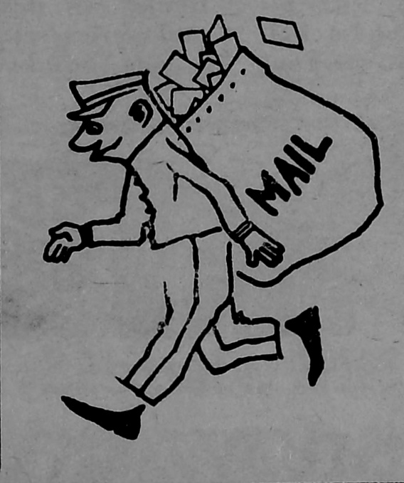

# 0005_Page 5

*Ohio Wesleyan Transcript, Delaware, Ohio 43015*

Page 5

---

## Anderson Responds 'Personal Attack'

*By Daniel E. Anderson Associate Professor of Philosophy*

(Continued from page 4)

The Transcript:

It is with profound dismay that I noted that the debate over ROTC did not come to an end when the faculty voted on the issue Dec. 1. On Dec. 5 the Colonel in charge of the local ROTC unit saw fit to launch a personal attack on me.

This attack had been merely personal I should have ignored it in the belief that the issue, having come to vote, were better forgotten until and unless it should again become an issue for formal faculty consideration.

The attack, however, was not merely personal. The Colonel impugned my professional integrity, accused me of professional incompetence, and in effect called me a liar.

Even so, since only a small number of students and faculty were present, I might have ignored the issue in the interest of not extending an already acrimonious controversy further, but on Dec. 10 the Colonel chose to "reiterate" his attack by offering copies of his speech to anyone "who may be interested."

In view of these facts, silence on my part could only be interpreted as admitting that I believe the Colonel to have been substantially correct. If he is correct, if I am in fact an incompetent scholar, an incompetent logician, and given to academic dishonesty, then in the interest of preserving the academic community I should resign or be dismissed. In the light of such considerations I feel that I cannot remain silent.

In his speech at the Dec. 5 meeting, which was called in order to present "information about the Air Force ROTC program at OWU and the new selective service system") the Colonel in order to give those present "some idea of the level and integrity of the charges being directed against Air Force ROTC . . ." attacked the following from a paper I had prepared criticizing the Report of the Special Committee on ROTC to the Secretary of Defense:

"The selection of the Department of Defense Committee may be open to some question inasmuch as there is strong evidence that in at least one case a member (Dr. Longenecker) was selected because he had demonstrated a bias toward the ROTC program." (He dismissed a tenured associate professor against the recommendation of a Faculty Hearing committee, because he "disrupted" an ROTC awards ceremony)

The main point of this paragraph seems incontestable. According to the Tulane alumni magazine (page 6) a Faculty Committee's findings were that the faculty member's "actions were a serious violation of University policy but were not sufficient to warrant dismissal at this time."

The article goes on to say that "Dr. Longenecker [President of Tulane] generally agreed with the findings but not with the recommended penalties and . . in a special report to the Board recommended that [the faculty member] be dismissed from the faculty immediately. . ." And on the following page, adds that one "outgrowth of the ROTC controversy was the U.S. Department of Defense designation of Tulane as one of six universities to aid the DOD in reevaluating ROTC's role on the campus."

The Colonel, however, in order to discredit me chose to make issues of two minor irrelevancies. The first was the technical question of whether the actual dismissal was an action of the President or of the Board.

The second was whether or not the faculty member involved was tenured (Although there is one footnote (page 34) to the effect that the faculty member's notification of tenure stated that it would not take effect until July, there is no indication that his right to be considered as having tenure was questioned either by the President or by the Board.)

If I were to yield to both points the fact would remain that there is strong evidence that Dr. Longenecker was selected for the DOD Committee because he had demonstrated a bias toward ROTC.

Moreover, this paragraph is presented as a very minor point in a report running six and two thirds pages. The remaining six and a half pages, the Colonel said, are "shot through with misquotes, statements taken out of context, and allegations which are unsupported by fact and weak in logic," and further, he said, my comments "lack the careful judgment and the objectivity which one has the right to expect from a scholar."

Inasmuch as these charges are unspecified, it is quite impossible for me to reply to them.

Inasmuch as they amount to a claim that I lack the professional qualifications for the position I hold at Ohio Wesleyan as a logician and as a scholar, it would seem to me to be in order for their author either to request the administration to institute proceedings toward having me removed from the faculty, or publicly to retract the charges, admit that they are unjust, and apologize.

> Photo: A cartoon illustration of a mail carrier running with a mailbag.

> Photo: a cartoon illustration of a person mailing a letter

---

## Letters To The Editor

Letters To The Editor section containing correspondence from the academic community.

---

## Advertisements

### Lanz Printing Co.

Lanz Printing Co. 
Offset and Letterpress 
257 CLEVELAND AVE. 
COLUMBUS, OHIO 
Telephone: 221-1724

### The Style Shop

Welcome Back 
O.W.U. Students 
from 
The Style Shop 
January Clearance Sale 
Now in Progress

### Ohio Wesleyan Transcript

If You Didn't Like Us Last Year 
Or The Year Before. . . Or the Year Before That 
GIVE US ANOTHER CHANCE 
Please add my name to your 1970 subscription list. I understand that I will receive 18 weekly issues of The Transcript at a cost of $4.50 delivered to my door. 
Name: _________________________ Please Print 
[ ] check enclosed 
Address: ________________________________________________________________________ 
City State Zip 
Ohio Wesleyan Transcript 
"an independent student newspaper" 
OHIO WESLEYAN UNIVERSITY 
DELAWARE, OHIO 43015 
A Newspaper No Parent Should Be Without

