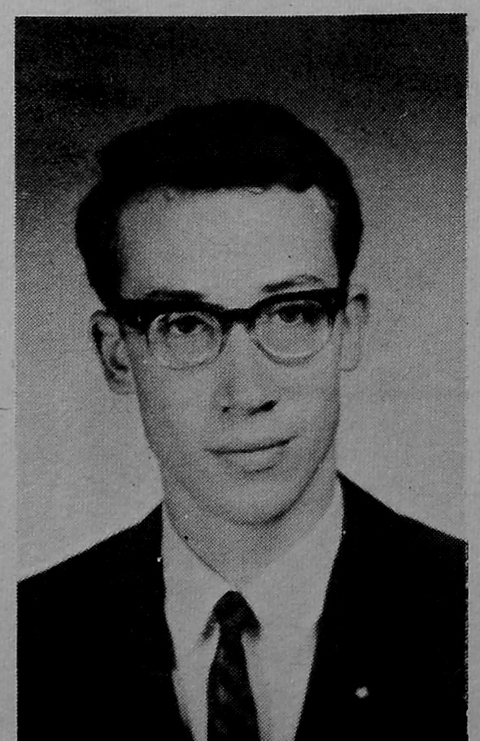

# 0006_Page 6

*OHIO WESLEYAN TRANSCRIPT January 7, 1970*

Page 6

---

## Henley, Small, Shively Named Fall Sport MVPs; Team Captains Elected

63 OWU athletes were awarded varsity athletic letters Dec. 3 at the annual Fall Term Sports Banquet held in the Memorial Union Building Ball Room. 35 letters went to football players, 22 to the soccer team and six to cross country runners.

Junior Rich Henley, the leading ground gainer in the Ohio Conference with 1,036 yards and an All-OC first team selection, took the Bun Award for the most valuable football player of 1969.

Sophomore Clay Small, a goalie, received the Larry Lays Award for the most valuable player in soccer.

John Shively, a senior and All-American six-mile track runner, received the Gurnecht Award for being the most valuable runner on the squad as well as the Transcript's Athlete of the Term award.

Junior linebacker Steve Yost, sophomore soccerman Art Young and Freshman harrier Tom Rees each received the Most Improved Awards in their respective sports.

Randy Clements, senior defensive end, received the Rayburn Award for “giving the most” to the OWU football team both on and off the field. Senior Attilla Daray, an All-OC offensive guard, won the Staten “Get-Up and Go” Award for the greatest desire and spirit.

Team captains were also announced for the 1970 season in both football and soccer. Juniors Rich Henley, Tony Heald and Tom Mulligan were elected tri-captains in football, and Juniors Dave Hain and Greg Subtelny were named soccer co-captains.

In addition to the letter winners, 70 other athletes received certificates or other special awards.

Men receiving letters are listed below by respective sports.

Football

Bennett, Tarry; Billington, Peter; Bishop, Richard H.; Burke, Thomas; Buttermore, Stephen; Case, Stephen; Clements, Randy; Clevenger, James; Daray, Attilla; Dutton, Stephen; Dziengelewski, Bernard; Flossie, Timothy; Hart, James; Heald, Tony; Hern, Tom; Henley, Richard.

Holden, Michael; Kaiser, John; Kellough, Tony; Kendall, Daniel; Lambert, Chris; Liller, Thomas; Mulligan, Thomas; Nelson, David; Newton, Henry A.; Parr, Clendon; Peyton, Thomas; Radcliffe, John; Scaravilli, Charles; Spencer, Daniel; Tharp, Michael; Troyer, Bart D.; Truesdell, Tom; Warner, Edw. E.; Yost, Steve.

Soccer

Bishop, William; Brannan, John; Brooks, Michael; Crecraft, Frederick; Fox, Malcolm; Gould, Roger L.; Hain, David; Handyside, Keith; Kreider, Rea; Ladjevardi, Ali; Luthi, Raymond.

Morris, Robert; Otshinga, Emmanuel; Rinda, Terry; Roblin, Lee; Searl, Robert; Sherwood, Steve; Small, Clay; Subtelny, Greg; Wagner, Richard; Williams, Thomas; Young, Arthur.

Cross Country

DeMott, John; Haraway, Charles; Lanning, John; McClure, George; Rees, David T.; Shively, John.

> Photo: HEAD FOOTBALL COACH Jack Fouts posed for photographers along with his 1970 tri-captains after last months Fall Sports Banquet. From left to right are Tony Heald, Fouts, Tom Mulligan and Rich Henley. All three tri-captains are juniors and were elected to their posts by a team vote at the end of the '69 season. Transcript Photo (Brian Fitzpatrick)

> Photo: Head Football Coach Jack Fouts with the 1970 football tri-captains.

---

## Women's Basketball Starts New Season With Changes

Women's basketball at OWU will take on a new look this year with radically changed rules and a number of new faces.

The biggest change in the game is the subtracting of a player from the field. The six man team of the old game consisted of two stationary forwards, who remained in one half of the court, two stationary guards, also limited to one half the court and two rovers, who could travel the entire court. The new team consists of five players, all of whom may travel the entire court. Another change, which was made to speed up the pace of the game, is the imposing of a thirty second time limit on shooting; i.e. as soon as one team gains possession of the ball, that team has thirty seconds to shoot the ball. The new rules are similar to those in men's basketball, and were made to make the women's game faster and more interesting.

OWU has four returning players to its women's team this year. They are manager-player Sue Bowser, Linda Mackey, Melanie Moore and Karen Pyke.

Last year's team had an 8 - 1 record, giving up only four points all season in OWU's only loss of the season to Otterbein College. According to Miss Helen Masson, coach of the women's team, prospects for this year's team are favorable. She expects Otterbein to again be the toughest team.

A tentative schedule has been set up, with all but two games set. The games already scheduled are January 22 at Ashland, February 7 at Wittenberg, February 10 at Wooster, February 14 at Ohio University, February 19 with Muskingum at OWU and March 7 with Capital at OWU.

---

## Shively Named Athlete Of Term

John Shively was named Athlete of the Term for the fall term at the Fall Sports Banquet last month. Shively was the number one runner on the winless harrier team.

The award was made by Roy Bumsted, sports editor of the Transcript, who cited Shively's three first place finishes in six meets and his 16th place finish in the National Collegiate Athletic Association — Small College Division Meet (the top fifteen were named all-Americans).

Shively also set two course records last year at Wooster College, Wooster, O., and at Ohio University, Athens, O.

In strong consideration for the award were junior football tailback Rich Henley who set two school records for season yards gained and most rushing attempts and Ali Ladjevardi, captain of the soccer team, a four letterman and winner of national recognition.

Shively will be in contention for the Transcript's Athlete of the Year Award along with the winter and spring term winners.

> Photo: 

> Photo: A portrait of John Shively, a cross country athlete.

---

## Advertisements

### snow trails MANSFIELD

SKI where it's happening! snow trails MANSFIELD
Chair • T-Bars • Tows • Snow Machines • Night Skiing
Swiss Barn Daylodge • Fireplace Lounges • Hot Food
Wine • Beer • Live Entertainment
Ski Shop • Ski School • Ski Patrol
Rentals • Toboggan Run • Fun
FREE FOLDER! Write Snow Trails,
Box 160, Mansfield, Ohio 44901
or call (419) 522-7393
POSSUM RUN ROAD

### THE O.W.U. BOOKSTORE

IF IT'S FOR SCHOOL IT'S AT THE BOOKSTORE
THE O.W.U. BOOKSTORE
A Division of OHIO WESLEYAN UNIVERSITY

